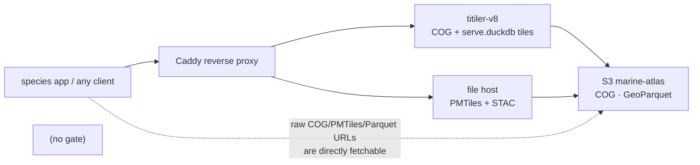
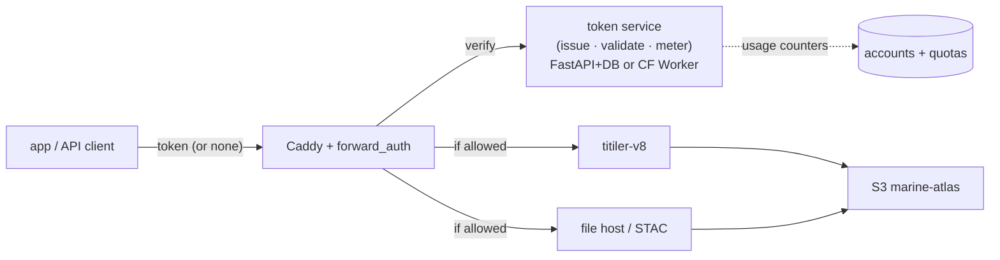
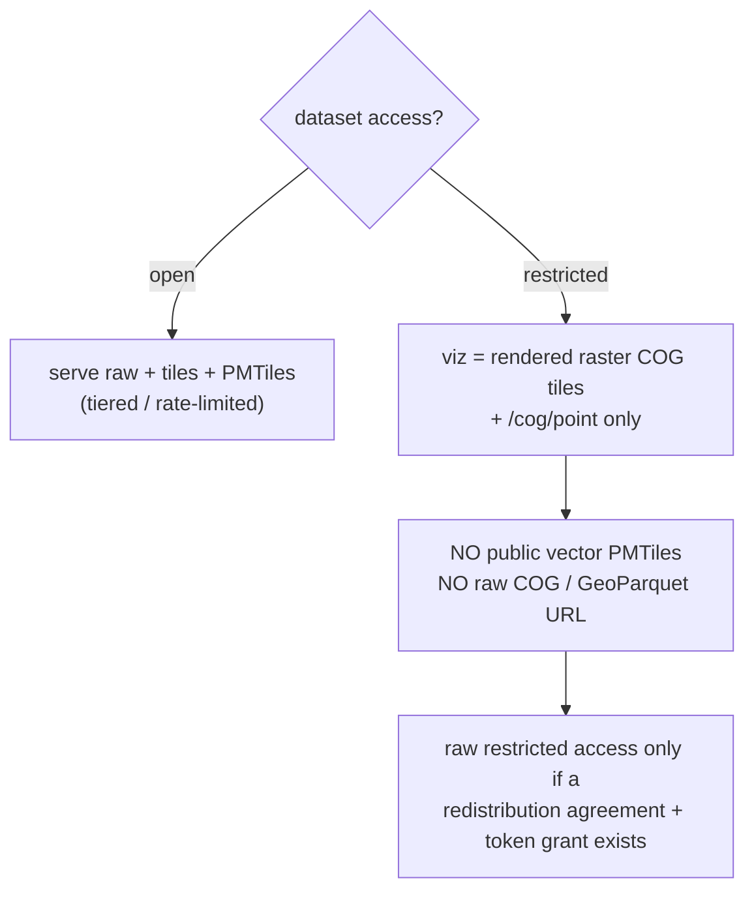
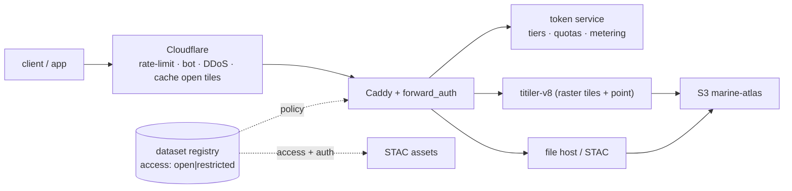

# Access control for restricted SDM datasets — design options

**Status:** design proposal for review · 2026-07-15
**Context:** the species app + marine-atlas are oriented around a public, anonymous
**STAC → COG (titiler) / PMTiles (file-host)** apparatus behind Caddy. Some providers permit
**visualization but not redistribution** (BirdLife BOTW, IUCN Red List, future "AquaX"). We want to
(1) honor those terms while keeping the data **viewable** in the app, (2) **track usage**, and
(3) open a **funding path** via tiered access (free anonymous → free token → paid).

---

## 1. The core tension: "visualization" vs "distribution" is a spectrum, not a switch

The same pipeline emits several artifacts per model, and they differ a lot in *redistribution risk*:

| Artifact | What it is | Redistribution risk | Needed for app viz? |
|---|---|---|---|
| `model_cell` / GeoParquet (S3) | the packaged dataset (cell_id, val) | **High** — it *is* the dataset | No |
| raw COG `.tif` (S3) | full-resolution raster grid | **High** | No (titiler renders it) |
| **vector PMTiles** (file-host) | **the full source geometry** | **High** — a tile *is* the polygon | Only for crisp vector overlay |
| rendered raster tiles (titiler COG→PNG) | server-rendered pixels, per z/x/y | **Low–Med** (down-sampled, reassembly is lossy) | **Yes** |
| point / stats queries (`/cog/point`, cell-SQL) | one value at one location | **Low** | Yes (click-to-inspect) |
| STAC metadata | catalog JSON; **but asset `href`s leak the raw file URLs** | Low itself / High if it points at raw files | Yes (discovery) |

**Key insight:** the *protectable* surface is the **raw asset files + full-fidelity vector tiles**.
The *viz* surface is **rendered raster tiles + point queries**. A restricted dataset can be shown
as **rendered raster** without ever handing out the redistributable file or geometry — and we already
build a **gridded COG per model** (Phase C dual-representation), so the raster path exists today.

> ⚖️ **Legal reality that shapes everything below:** a paid MarineSensitivity tier does **not** grant
> a BOTW/IUCN redistribution license we don't hold. So unless MS negotiates redistribution rights,
> **restricted raw data is viz-only for *everyone*** — tiers/metering/funding apply to the **open**
> data + API usage. The mechanism should still be flexible enough to grant restricted *raw* access to
> a specific authenticated user *if* an agreement is later obtained.

---

## 2. Current architecture (all anonymous)

Anyone can read the STAC, follow an asset `href`, and `wget` the full COG/PMTiles — that is the gap.

---

## 3. Options

### Option A — Soft: terms-of-use + rate-limit + hide raw URLs
Keep everything anonymous; add a click-through license, `robots.txt`, Caddy rate limiting, and stop
publishing raw restricted `href`s (STAC points at tile endpoints only).

- ✅ Minimal infra; app unchanged; immediate partial protection.
- ❌ Weak — tiles can be scraped and reassembled; no usage tracking; no funding hook. Doesn't truly
  stop a determined redistributor.

### Option B — Token-gated reverse proxy  *(core of the recommendation)*
A **forward-auth** layer at Caddy validates a **JWT/token** and enforces per-dataset, per-tier policy.
A small **token service** issues/validates tokens and meters usage.

- ✅ One choke point; real tiers; usage tracking; funding hook; standard pattern.
- ❌ Infra: token issuance, validation, quotas, a user store; the app must present a credential for
  gated actions; auth complicates CDN caching (see §4).

### Option C — Signed-URL broker
A backend mints **short-lived signed URLs** (S3 presigned or HMAC-signed titiler URLs) per session;
restricted assets are only signed for authorized tiers.

- ✅ No long-lived public URLs; fine-grained; S3-native.
- ❌ The app must broker every URL; per-session URLs hurt tile caching; more moving parts.

### Option D — Restricted = raster-only (a *policy*, pairs with B)
For restricted datasets, **never serve the raw file or the vector PMTiles publicly** — show the
**rendered raster COG** (Phase C gridded COG) + `/cog/point`. The public sees pixels, never the
packaged geometry/values.

- ✅ Strongest honoring of "viz OK, distribution NOT"; needs **no login** for basic viewing;
  reuses existing per-model COGs.
- ❌ Loses crisp vector overlay for restricted layers (raster instead); slight app change to prefer
  the COG representation for restricted datasets.

### Option E — Managed gateway (Cloudflare / API gateway / Auth0)
Put Cloudflare (Workers + Access + rate-limiting/bot/DDoS) or an API gateway (Kong/Tyk) or Auth0 in
front for token management + protection.

- ✅ Offloads infra; robust rate-limit/bot/DDoS; analytics; generous free tiers.
- ❌ Third-party dependency; cost at scale; less control; possible vendor lock-in.

---

## 4. Cross-cutting considerations

- **Licensing ≠ tiers** (§1 note). Decide first: is restricted raw data *ever* downloadable from MS?
  Recommended default: **no** (viz-only for all); tiers meter the **open** data + API.
- **CDN / caching.** Anonymous open tiles should stay publicly cacheable (fast, cheap). Gating breaks
  shared caching, so **cache open tiles at the edge; gate only restricted + bulk**. Use a token that a
  CDN can `Vary` on (header/cookie) rather than per-session signed URLs where caching matters.
- **App UX.** Keep anonymous viz working: restricted-as-raster is anonymous (rate-limited); prompt
  sign-in/token only for **bulk download** or **high API volume**. The app itself may carry a service
  identity so its tiles are never blocked.
- **Token management.** Registration + JWT issue/revoke + per-token quota accounting (Redis/DB).
  Build in-house (FastAPI + Postgres/SQLite, full control) vs Cloudflare Workers/Access vs Auth0
  (fastest, least control).
- **Abuse.** Per-IP + per-token rate limits, quotas, tile-scraping heuristics, bot detection.
- **Analytics / funding.** Per-token usage metering → dashboards → billing for the paid tier.
- **STAC clients (R/Python).** For the *open* bulk tiers, advertise the auth scheme via the STAC
  **`auth` extension** so `rstac` / `pystac` clients can attach a bearer token (ties into the
  vignettes + STAC-alignment task).

---

## 5. Recommendation — a layered policy, phased

**Combine D (policy) + B (mechanism) + E (edge protection), driven by a registry `access` flag.**

1. **Classify** every dataset/asset `access: open | restricted` (+ provider + terms) in the `dataset`
   registry and surface it in STAC (`access` field + auth scheme). *This single flag drives all policy.*
2. **Restricted = viz-only for all (D):** serve restricted layers as **rendered raster COG tiles +
   `/cog/point`**; **do not publish** their vector PMTiles or raw COG/GeoParquet URLs. Honors terms
   with **no login** for viewing.
3. **Single choke point (B):** **Caddy `forward_auth`** enforces the raw-file block for restricted
   assets, rate-limits anonymous tiles, and validates JWTs for higher tiers. A small **token service**
   issues/validates tokens and meters usage.
4. **Tiers on OPEN data + API:** anonymous (rate-limited tiles + limited open bulk) → free token
   (register email; higher limits; usage tracked) → paid (bulk open data, high API limits).
   Restricted stays viz-only regardless, unless a redistribution agreement later flips a per-token grant.
5. **Edge (E):** front with **Cloudflare** for rate-limit/bot/DDoS and public caching of open tiles;
   keep the **token service self-hosted** (control + metering, avoids Auth0 lock-in). Cloudflare Access
   is a fallback if we want zero auth code initially.
6. **STAC auth extension** so R/Python clients authenticate for open bulk tiers.

Why this and not the others: Option A alone doesn't protect or fund; C's per-session URLs fight our
CDN caching; E-only cedes control of metering (the funding core). D+B+E protects restricted data
**immediately and for everyone** (no accounts needed), then layers tokens/tiers for tracking + funding
without breaking anonymous viz.

---

## 6. Phased implementation

| Phase | Goal | Work | Needs accounts? |
|---|---|---|---|
| **1 — Protect terms (now)** | stop restricted redistribution | `access` flag in registry+STAC; restricted → raster-COG only, drop public PMTiles + raw hrefs; Caddy rate-limit + block raw restricted paths; Cloudflare in front | No |
| **2 — Track + tier** | usage metering + free/paid tiers | token service (issue/validate/meter); Caddy `forward_auth`; anonymous vs free-token quotas; usage dashboard | Yes (free token) |
| **3 — Sustain** | paid bulk + client support | billing on paid tier; STAC `auth` extension; `rstac`/`pystac` token support; docs | Yes (paid) |

Phase 1 alone satisfies the provider-terms obligation and needs **no user accounts** — worth doing
regardless of the funding decision.

---

## 7. Open questions for review

1. **Licensing:** is restricted **raw** data *ever* downloadable from MS (with an agreement), or
   strictly viz-only forever? (Drives whether tiers ever unlock restricted files.)
2. **Funding model:** who pays (researchers, agencies, commercial)? What counts as "bulk" vs "API"?
   What are the anonymous / free-token / paid limits?
3. **Build vs buy:** self-hosted token service (control + metering) vs Cloudflare Access vs Auth0?
4. **Privacy:** is per-user tracking of anonymous *viz* acceptable, or only metered at the token tiers?
5. **Restricted vector:** OK to drop crisp vector overlay for BOTW/IUCN in favor of the raster COG,
   or is vector interactivity important enough to pursue signed short-lived vector tiles instead?
