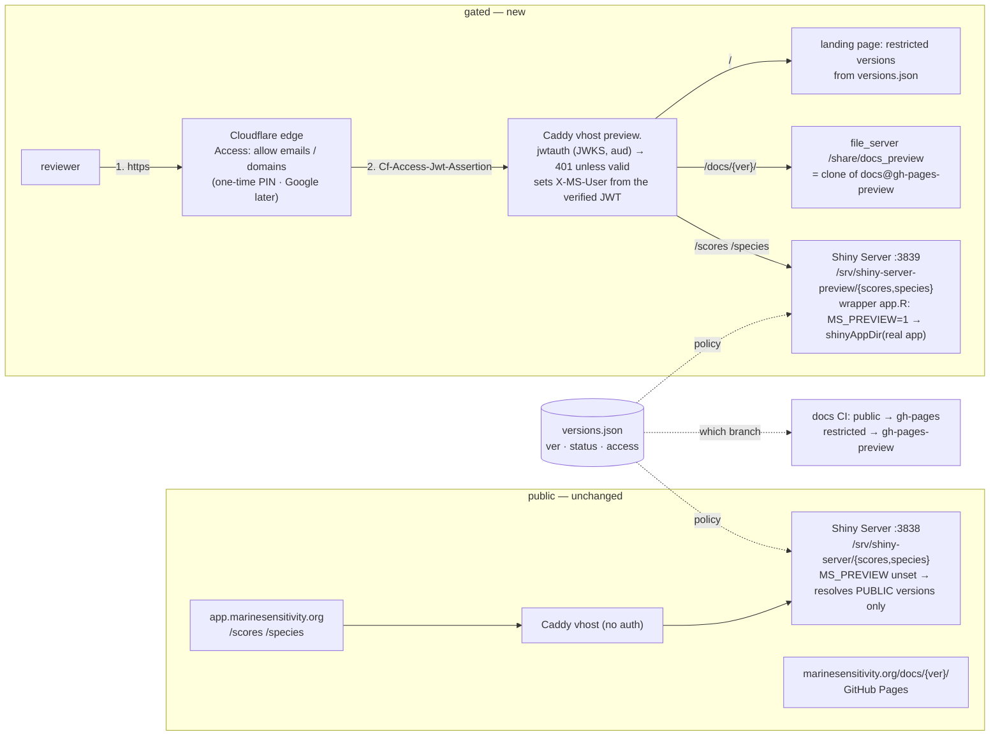

# Pre-release review gate — `preview.marinesensitivity.org` + Cloudflare Access

**Status:** plan, agreed 2026-08-15 · **Owner:** Ben · **First users:** ben@oceanmetrics.io (Google
Workspace), timothy.white@boem.gov (BOEM, a .gov Microsoft account) · **First gated release:** v8

Sign-in-only access to a **restricted release** of the apps and docs, so SDM data providers and
BOEM/NOAA colleagues can review new dataset ingests and the density-normalization methods before
anything is public. Retired and released versions stay exactly as open as they are today.

## Decisions taken (2026-08-15, with Ben)

| # | Decision | Chosen |
|---|---|---|
| 1 | Login mechanism | **Cloudflare Access** (Zero Trust, free ≤50 users). Emailed **one-time PIN** first (works for any address, no IdP setup, nothing to consent to in the DOI tenant); Google sign-in for Ben as an optional convenience later. We hold **no passwords**. Requires moving `marinesensitivity.org` nameservers Squarespace → Cloudflare. |
| 2 | Gated surface | **One new host, `preview.marinesensitivity.org`**, serving `/scores`, `/species`, `/docs/{ver}/` under one login. Public hosts untouched. The apps run as a **second Shiny Server `server` block** (same code, `MS_PREVIEW=1`) that alone may render restricted versions. |
| 3 | Data scope | **Presentation only.** v8's S3 objects, `titiler-v8` tiles and STAC stay public but are dropped from the storage index page. Dataset-level non-redistribution stays `2026-07-15_access-control_restricted-datasets.md`. |
| 4 | Visibility | **Show it locked.** Version pickers + docs switcher list "v8 · pre-release · restricted 🔒" linking to the preview host. `versions.json` stays public. |

**Threat model, stated plainly:** "hidden" means *not on the public web surface, not indexed, not
reachable without signing in* — it does **not** mean secret. Sources are in public GitHub repos
(`apps`, `docs`), v8 data is public on S3 by decision 3, and the release's existence is public in
`versions.json`. What the gate prevents is a visitor (or a search engine) landing on unreviewed
results, and it gives us an audit trail of who looked.

## Why these, briefly

- **Why not shinyOAuth / in-app auth?** It is a good package, but it covers only Shiny (docs need
  something else), needs a Google *and* a Microsoft app registration, and the Microsoft one hinges
  on DOI's tenant allowing user consent to a third-party app — unknowable without Tim trying. Caddy
  already fronts apps *and* docs, so gating there is one mechanism for both, with zero auth code in R.
- **Why not "trust an identity header in the app"?** Shiny Server OSS opens its **own** websocket
  to the R worker (`/opt/shiny-server/lib/proxy/sockjs.js:167 createWebSocketClient(pathInfo)`);
  no client/proxy header reaches `session$request`. Only the initial page GET (`ui(req)`) sees
  headers. A header-trusting design would leave the shared instance steerable to v8 over the
  websocket (`url_search` is client-supplied). A **separate process** whose policy is an env var
  is structural: the public process has no code path that renders a restricted version.
- **Why a new host, not `?ver=` on the old ones?** Which versions are gated is *registry data*;
  Caddy cannot read `versions.json`, and putting a version list in the Caddyfile is the "edit an
  app to publish v9" anti-pattern. One host = one login covers apps + docs, cookies scoped, and
  the public vhosts have no auth in their request path at all.
- **Why Cloudflare rather than self-hosted (Authelia / Pocket ID + oauth2-proxy)?** The dependable
  login for a `.gov` mailbox is an emailed code; Access has it built in with no SMTP relay, no
  user database, and later a one-line policy for `@boem.gov` / `@noaa.gov` domains. Verified
  alternatives if this ever changes: Pocket ID (passkeys + `EMAIL_ONE_TIME_ACCESS_AS_UNAUTHENTICATED_ENABLED`)
  behind `forward_auth`, or Authelia with a users file.

## Facts established (so the next session need not re-derive them)

- Docs are **GitHub Pages** at `https://marinesensitivity.org/docs/{ver}/` (org site custom
  domain; project repo `MarineSensitivity/docs`, branch `gh-pages`, layout `v1…v8/`, root
  `index.html` → `latest.txt`). `.github/workflows/quarto-publish.yaml` renders a matrix over
  `versions.json` and **one** `publish` job writes gh-pages. No `site-url` in `_quarto.yml` —
  links are relative, so a book can be served under any host at `/docs/{ver}/`.
  `_version-switcher.html` reads `versions.json` and derives the version from the URL path.
- **`docs.marinesensitivity.org` already resolves to the server (100.25.173.0) but nothing serves
  it** (TLS alert) — free hostname; not needed under decision 2 but harmless.
- Apps: `app.marinesensitivity.org` → Caddy → `rstudio:3838` (Shiny Server v1.5.24, config is
  rocker's default; `/srv/shiny-server` = host `/share/shiny_apps`, where `scores` / `species` are
  symlinks to `/share/github/MarineSensitivity/apps_v8/{scores,species}`). `DEPLOY_APPS=1` pulls
  `apps_v8` and touches `apps_v8/{scores,species}/restart.txt`.
- Version policy hooks already exist: `apps/*/app.R::ver_of()` → `msens::atlas_resolve_ver(ver, allow=…)`;
  registry = `workflows/data/versions.csv` (`ver,status,released,title`) →
  `build_version_manifest.qmd` → `s3://…/marine-atlas/versions.json`; `msens::version_picker_html()`.
- DNS: `marinesensitivity.org` on Squarespace/NS1 (registrar Tucows via Squarespace); apex → GitHub
  Pages A records; ~20 hostnames → 100.25.173.0. `oceanmetrics.io` on Google Cloud DNS. Neither on
  Cloudflare today.
- Caddy is already a custom xcaddy build (`go-pmtiles/caddy`), so adding a JWT module is routine.
  Server has 16 GB RAM, ~12 GB available; no new heavy service is needed for this design.

---

## Design



Policy lives in **one place** — a new `access` field of the version registry — and three consumers
read it: the apps (`msens::atlas_resolve_ver`), the docs CI (which branch a book publishes to),
and the UI chrome (lock badges, hrefs). Cloudflare + Caddy know nothing about versions; they gate a
hostname.

### 1. Registry — `access` per version

- `workflows/data/versions.csv` gains `access` ∈ {`public`, `restricted`}. Row for v8 →
  `restricted` (in Phase 2, not before).
- `msens::atlas_versions()` parses `access`; **when absent, derive it**: `prerelease → restricted`,
  else `public` (older `versions.json` readers keep working; the field is explicit so a released
  version *could* be gated later without a schema change). Unknown values error, like `status`.
- `msens::atlas_resolve_ver()` gains `allow_access = "public"` by default; the apps pass
  `c("public","restricted")` when `Sys.getenv("MS_PREVIEW") == "1"`. Named-but-disallowed
  versions error as today; `ver_of()` catches it and falls back to `latest`, showing a modal:
  *"v8 is a pre-release under review. Reviewers: sign in at preview.marinesensitivity.org/scores/?ver=v8."*
- `build_version_manifest.qmd` validation: the promoted version (`latest.txt`) **must be
  `public`** — the default view can never be behind a login. `manifest_build()` copies `access`
  into `manifest.json` for completeness.
- Tests (`msens/tests/testthat/test-version.R`): parse explicit `access`; derive when absent;
  reject bad values; `atlas_resolve_ver("v8", allow_access="public")` errors while
  `c("public","restricted")` returns it; picker markup shows the lock + preview href for restricted.
  Version bump + `NEWS.md` (per `../CLAUDE.md`), and bump `MSENS_REF`/`MSENS_MIN` in
  `server/rstudio/Dockerfile` so the container's package is not stale.

### 2. Cloudflare — zone + Access

Manual steps are inevitable here (an account, a nameserver change); everything that *can* be
scripted is committed under `server/cloudflare/`:

- `README.md` — the exact manual sequence, and the policy as documentation.
- `dns_snapshot.sh` — parses every site label out of `caddy/Caddyfile` plus the apex, `www`, MX/TXT,
  and `dig`s each; run **before** the NS change and **after** propagation and diff the two files.
  Cloudflare's import scan is a convenience, not proof; the Squarespace panel is the source of
  truth for records the Caddyfile does not name (mail, verification TXTs).
- `access.sh` — idempotent create/update via the API (token in `server/.env`: `CF_API_TOKEN`,
  `CF_ACCOUNT_ID`, `CF_ZONE_ID`): the self-hosted Access application (`preview.marinesensitivity.org`,
  all paths, session 24 h), policy *Allow* with `Include: emails [ben@oceanmetrics.io,
  timothy.white@boem.gov]`, a *Service Auth* policy bound to a **service token** (`msens-preview-check`)
  so `curl` and the release notebook's checks can pass the gate headlessly, and a Cache Rule
  **Bypass** for the host (keep origin behavior identical; no stale Shiny assets at the edge).
  Prints the application **AUD tag** and team domain, which the Caddyfile needs.
- Zone setup: add `marinesensitivity.org`, reconcile records against the snapshot, **only
  `preview` proxied (orange)**, every other record DNS-only (grey) — the public hosts, the GitHub
  Pages apex and mail do not change behavior at all. SSL/TLS mode **Full (strict)**. Then change
  nameservers at Squarespace. Squarespace keeps the records, so rollback is pointing NS back.
- Identity: **One-time PIN** only at first (no setup). Google IdP later = an OAuth client in the
  oceanmetrics.io Workspace GCP project with the team-domain callback; documented, optional.
- Later, one policy edit: `Emails ending in @boem.gov, @noaa.gov` for self-serve reviewers.
- Access enforces before cache and supports WebSockets; the identity check happens on every
  request including the SockJS upgrade, so the JWT is present on everything Caddy sees.

### 3. Caddy — build, vhost, hygiene

- `caddy/Dockerfile`: `xcaddy build --with github.com/protomaps/go-pmtiles/caddy --with github.com/ggicci/caddy-jwt@<pin>`
  (pin the version; verify `jwk_url`, `from_header`, `issuer_whitelist`, `audience_whitelist`,
  `user_claims` are all supported at that pin — they are in current releases; contingency if the
  module disappoints: `forward_auth` to a ~40-line verifier container, or `caddy-security`).
- New vhost, env-parameterized with `{$CF_ACCESS_TEAM}` / `{$CF_ACCESS_AUD}` (Caddyfile-parse-time
  substitution; **not** `{env.*}`, which is runtime and not honored in every directive):

  ```
  preview.marinesensitivity.org {
    log { output file /share/logs/caddy/preview.log … format json }   # user_id lands in the log
    header X-Robots-Tag "noindex, nofollow"
    jwtauth {
      jwk_url https://{$CF_ACCESS_TEAM}.cloudflareaccess.com/cdn-cgi/access/certs
      from_header Cf-Access-Jwt-Assertion
      issuer_whitelist https://{$CF_ACCESS_TEAM}.cloudflareaccess.com
      audience_whitelist {$CF_ACCESS_AUD}
      user_claims email
    }
    handle_path /docs/*  { root * /share/docs_preview; file_server }
    handle /scores*  { reverse_proxy rstudio:3839 { header_up X-MS-User {http.auth.user.id} } }
    handle /species* { reverse_proxy rstudio:3839 { header_up X-MS-User {http.auth.user.id} } }
    handle / { root * /share/caddy/preview; file_server }          # landing page
  }
  ```
  A request that bypasses Cloudflare (`--resolve` to the origin IP) has no JWT → **401** — that is
  the origin-side check Cloudflare documents, and it is what makes proxying-only-`preview` safe.
- Public vhosts (`app.marinesensitivity.org`): `request_header -X-MS-User` — never let a client
  supply the identity header the preview instance shows in its ribbon.
- Landing page `caddy/preview/index.html`: fetches `versions.json`, lists **restricted** versions
  with links to `/scores/?ver=`, `/species/?ver=`, `/docs/{ver}/` (same pattern as the docs
  switcher; nothing version-specific hardcoded).
- `DEPLOY_CADDY=1` in `release_marine-atlas.qmd` becomes `git pull` + `docker compose up -d --build caddy`
  (a no-op build when the Dockerfile is unchanged), since a plugin change needs an image, not a restart.
- Caddy's `{remote_host}` on the preview vhost is a Cloudflare IP; `msens::ms_client_ip()` should
  prefer `CF-Connecting-IP` when present (analytics only).

### 4. Shiny Server — a second `server` block, same code

- `server/rstudio/shiny-server.conf` (bind-mounted, or `COPY`'d in the Dockerfile — mounted is
  restart-only, preferred): keep the existing `listen 3838 { site_dir /srv/shiny-server }` and add
  `server { listen 3839; location / { site_dir /srv/shiny-server-preview; log_dir /var/log/shiny-server-preview; directory_index off; } }`.
  No port publish needed — Caddy reaches `rstudio:3839` on the compose network.
- `server/rstudio/shiny_apps_preview/{scores,species}/app.R` (bind-mounted to
  `/srv/shiny-server-preview`), each three lines:
  `Sys.setenv(MS_PREVIEW = "1"); shiny::shinyAppDir("/srv/shiny-server/scores")`.
  `shinyAppDir()`'s `onStart` does `setwd(appDir)` and serves the real `www/`, so relative
  `data/`, `cache/`, `www/` resolve to the real app; the wrapper's own dir holds only `app.R` and
  its `restart.txt`. Same URL paths on both hosts, no rewrites, two R processes.
- `DEPLOY_APPS=1` additionally touches `/share/shiny_apps_preview/{scores,species}/restart.txt`
  (the wrapper's dir is what Shiny Server watches; the inner `app.R` mtime alone may not roll it).
- Compose: new bind mounts (`./rstudio/shiny-server.conf`, `./rstudio/shiny_apps_preview`) →
  a one-time container recreate; do it in the same step as the `MSENS_MIN` bump rebuild (memory:
  a recreate resets the container R library, so it must come from a rebuilt image, never patched live).

### 5. Apps (`apps@main`) + `msens`

- `ver_of()`: `allow_access` from `MS_PREVIEW` (§1). Because `ui_impl(req)` and the server both go
  through it, the first HTML on the public instance already shows the fallback + modal.
- **curl-checkable sentinels** in `<head>`: `<meta name="ms-ver" content="{ver}">` and
  `<meta name="ms-preview" content="0|1">` — the verification below depends on these, so a
  browser is not needed to prove which version a host served.
- Preview instance: a thin ribbon *"PREVIEW · restricted release · signed in as {req$HTTP_X_MS_USER}"*
  (identity is only knowable in `ui(req)`; that is fine — it is display, not policy).
- `msens::version_picker_html()`: restricted → lock badge; `href` → `https://preview.marinesensitivity.org/scores/?ver={v}`
  on the public instance, plain `?ver=` on the preview instance (`preview_base` argument; env-driven).
- Analytics: `msens::ga_head("scores-preview" …)` on the preview instance so reviewer sessions
  don't mix into public counts.
- Species app: same `ver_of()`/sentinel/ribbon/picker changes.

### 6. Docs (`docs` repo)

- CI `versions` job emits **two matrices** from `versions.json` — `public` and `restricted`
  (`access`, defaulting from `status` if absent). `build` renders both. `publish` writes public
  books to `gh-pages` **and removes any version dir there whose access is restricted** (v8 is on
  gh-pages today and must leave), and writes restricted books to **`gh-pages-preview`** with the
  same `/{ver}/` layout (its own single commit; same race-free structure). Root redirect logic is
  unchanged (`latest` is public by §1's assertion).
- Server: `/share/docs_preview` = `git clone -b gh-pages-preview https://github.com/MarineSensitivity/docs`
  (public repo, read-only, no key). A tiny compose sidecar `docs-preview` (`alpine/git`, loop
  `git pull --ff-only` every 5 min) keeps it current with no inbound secret and no manual step —
  committed infra, like the Caddyfile. (`DEPLOY_DOCS=1` in the release notebook can force a pull.)
- `_version-switcher.html`: read `access`; restricted → "(pre-release · restricted 🔒)" and
  `https://preview.marinesensitivity.org/docs/{ver}/`; public → `https://marinesensitivity.org/docs/{ver}/`.
  Absolute hrefs so switching works from either host.
- `libs/versioned.R`: an `app_url(app, ver)` helper that returns the preview host for restricted
  versions; sweep the hardcoded `app.marinesensitivity.org/scores/` links in `index.qmd`, `apps.qmd`,
  `apps-guide.qmd`, `scoring.qmd`, `releases.qmd` to use it, so v8's own book points reviewers at
  the gated app.
- The rendered preview HTML sits on a public branch of an already-public repo — consistent with
  the threat model above (decision 4).

### 7. Workflows

- `data/versions.csv` `access` column; `build_version_manifest.qmd` validation (§1) and it writes
  `access` into `versions.json`; `publish_storage_index.qmd` **omits restricted versions from the
  generated `marine-atlas/index.html`** (objects stay; unadvertised).
- `release_marine-atlas.qmd`: `DEPLOY_APPS` touches the preview wrappers; `DEPLOY_CADDY` builds;
  new `DEPLOY_DOCS=1` (force the preview pull) — all documented in `CLAUDE.md`'s env-flag list.
- A **`CHECK_PREVIEW=1`** verification chunk (service token from `.env`) that runs the curl
  assertions below and `stopifnot`s them — a check that cannot pass on broken input
  (feedback memory `feedback_checks_that_cannot_fail`).

---

## Phases

**Phase 0 — build it dark (no user-visible change; v8 stays public).**
msens `access` + resolve rule + picker + tests → bump, NEWS, `MSENS_MIN` pin; apps `ver_of`,
sentinels, ribbon; `versions.csv` column present but v8 still `public`; docs CI split (nothing
moves yet); Caddy image with `caddy-jwt` + preview vhost (401s everything until Cloudflare
exists — verify it does); Shiny 3839 block + wrappers; `docs-preview` sidecar; landing page.
Deploy: `DEPLOY_CADDY`, rstudio rebuild/recreate, `DEPLOY_APPS`.
*Verify:* public app unchanged (`ms-ver` sentinel = v7 on `/scores/`, v8 still renders on the
public host because `access=public`); `rstudio:3839` answers inside the network; origin-direct
`preview` returns 401.

**Phase 1 — Cloudflare.** Account/team domain → `dns_snapshot.sh` (before) → add zone, reconcile
records, `preview` proxied only, Full (strict) → NS change at Squarespace → snapshot (after) diff
clean → `access.sh` (app + policies + service token + cache bypass) → set `CF_ACCESS_TEAM/AUD`
in `.env`, `DEPLOY_CADDY`.
*Verify:* Ben signs in by PIN and reaches `preview…/scores/` (still v7 by default — nothing is
restricted yet); service-token curl gets 200 with `ms-preview=1`; origin-direct still 401; every
public host's headers/TLS identical to the pre-migration snapshot; a Shiny session on preview stays
connected ≥ 5 min (WebSocket through the edge).

**Phase 2 — flip v8.** `versions.csv` v8 → `restricted` → `build_version_manifest` (publishes
`versions.json`) → touch app `restart.txt`s (per-process registry cache) → docs CI
`workflow_dispatch` (v8 leaves gh-pages, appears on gh-pages-preview; sidecar pulls) →
`publish_storage_index`.
*Verify (all curl, no browser):* `app…/scores/?ver=v8` → `ms-ver=v7` + fallback modal markup;
`preview…/scores/?ver=v8` with service token → `ms-ver=v8`, `ms-preview=1`; without token → 302
to `*.cloudflareaccess.com`; origin-direct → 401; `marinesensitivity.org/docs/v8/` → 404 and
`preview…/docs/v8/` (token) → 200 containing "documents release … v8"; storage index page no
longer lists `v8/`; docs switcher and app picker on public show the lock + preview href.
Then invite Tim: PIN arrives at his .gov mailbox, `/scores/?ver=v8` renders. That email landing
is the acceptance test for decision 1.

**Phase 2 hardening found while building Phase 0:** the plumber API's `POST /report` and
`GET /summary` take `ver` freely (`api/plumber.R`), so an aggregate report of a restricted
release could be rendered publicly. Small leak, but real: make them refuse `access = restricted`
versions unless the request carries a shared secret the preview app instance sends
(`MSENS_PREVIEW_TOKEN` in the rstudio + plumber env). Do it in Phase 2 with the flip.

**Phase 3 — later, separate decisions.** Google IdP for Ben; `@boem.gov`/`@noaa.gov` domain
policy; Microsoft IdP if DOI's tenant permits (test with Tim); Cloudflare in front of the *public*
hosts for caching/rate-limits (the 2026-07-15 plan's edge layer — a per-record toggle now that the
zone is there); the dataset-level restriction plan (private prefix + credentialed titiler/CI/app
readers). None of these is needed for the review workflow.

## Phase 0 log (2026-08-15)

Built and deployed dark: msens 0.30.0 (`access`, `atlas_allow_access()`, classed
`msens_restricted`, picker lock, `manifest_build(access=)`, 89+18 tests green), apps (`ver_of`
policy, `<meta ms-ver/ms-preview>`, PREVIEW badge, restricted modal, `-preview` analytics
tag), workflows (`versions.csv` `access` column, registry validation + round-trip, storage index
withholding, `DEPLOY_CADDY` build+validate+restart, `DEPLOY_DOCS`, `CHECK_PREVIEW`), server
(caddy-jwt image, preview vhost failing closed, second Shiny Server block + wrappers,
`docs-preview` sidecar, `dns_before.txt`), docs (CI two-branch publish, access-aware switcher,
`doc_app_url()` links). Verified locally before deploy: public instance refuses `?ver=v8` the
moment the registry lacks `access` (fail-closed works — hence the ordering rule), preview
instance renders it with the badge; wrapper serves the inner `www/`.

Learned: a wildcard `*.marinesensitivity.org → 100.25.173.0` already exists, so `preview.` needed
no DNS step for the dark deploy; `/share/docs_preview` must be chowned to uid 1000 (Docker creates
bind sources root-owned).

**Phase 0b (same day) — the path scheme + token binding.** msens 0.31.0 (`ver_token_sign/verify`,
`preview_app_url/docs_url`, 28 tests), apps (hidden `ms_ver_token` input; `ver_of_session()`; preview
picker links by path; no URL echo on preview), server (`preview_routes.caddy` + the functional test,
`MS_TOKEN_SECRET` in `.env` → Renviron.site, verified reaching `su -l shiny`; caddy pinned 2.11.4;
msens pin 0.31.0), docs (`doc_app_url()` path form for restricted), release notebook (routes test in
`DEPLOY_CADDY`; `CHECK_PREVIEW` probes the path form and asserts the pre-path spelling is never 200).
Verified: Chrome on the public host — the server rewrote `?ver=v6&probe=1` to `?ver=v6` (session bound
to the token); in R — garbage token + client `?ver=v6` → v7, restricted-version token replayed on the
public instance → v7, on preview → v9; on the server — `PREVIEW_ROUTES_OK` (401 without token;
`/v8/scores/` → app, `ms-ver=v8`, `ms-preview=1`, identity in the badge; `?ver=v7` on `/v8/` overridden;
sockjs + assets proxy; `/scores/?ver=v8` → 302 `/v8/scores/`, never proxied); `CHECK_PREVIEW` green.
Gotcha met: query manipulation is `uri query <key> <value>` (no standalone `query` directive).

**Status at end of 2026-08-15 — plainly.** Everything above is deployed but **DARK: no human can open
any preview URL** (`preview.marinesensitivity.org/…` answers 401 — now with a page saying so — because
the only door is Cloudflare Access and it is not in front yet). What "verified" meant: (a) the routes
+ app were driven by a throwaway Caddy holding a *test* JWT (`caddy/test/run.sh`); (b) the session-token
binding was checked in Chrome on the **public** app (server rewrote `?ver=v6&probe=1` → `?ver=v6`).
Neither is visible to a person. Ben chose to wait; nothing further today. **Phase 1 needs:** a
Cloudflare account, the nameserver change at Squarespace (`cloudflare/dns_before.txt` is the "before"),
then `access.sh` (one Access application per restricted version + landing catch-all + service token),
`CF_ACCESS_TEAM/AUD` into the server `.env`, `DEPLOY_CADDY`. A basic-auth stopgap (env-switched auth
file instead of jwtauth) was offered for a look-before-Phase-1 and declined.

## Rollback

- Access misbehaves → set `preview` DNS-only; the vhost then 401s everything (nothing leaks).
- Cloudflare wholesale → point NS back to Squarespace (records were never deleted there).
- Restricted → public: flip `access`, re-run `build_version_manifest` + docs CI; nothing else.

## Per-user, PER-VERSION access — ADOPTED 2026-08-15 (Ben: "hostname + path, e.g. /v9/, not ?ver=v9")

Implemented the same day (see the Phase 0 log): the preview host's URL scheme is
`/{ver}/scores/`, `/{ver}/species/`, `/docs/{ver}/` (`server/caddy/preview_routes.caddy`, proven by
`server/caddy/test/run.sh`, 15 assertions, run by `DEPLOY_CADDY`); the apps bind each session to the
version its page was served for with `msens::ver_token_*` (0.31.0); `msens::preview_app_url()` is the
single source of the URL shape (apps, docs, landing page, `CHECK_PREVIEW`). What remains is Phase 1's
part: `access.sh` creates **one Access application per restricted version** (`/v9/*` + `/docs/v9/*`,
its own reviewer policy) plus a catch-all for the landing page.

The analysis that led here, kept for the record:

**As built in Phase 0 proper, authentication opened every restricted version**: one Access application covers the whole
host, the preview Shiny instance resolves any `access = restricted` version, and `/docs/{ver}/` serves
every restricted book. A reviewer of v9 can also open v10.

**Per-user-per-version needs two additions** (~half a day, best decided BEFORE Phase 1 creates the
Access application, because it changes the URL scheme reviewers are given):

1. **Version in the PATH on the preview host.** Cloudflare Access scopes applications by hostname +
   path (wildcards) — never by query string. Docs already are (`/docs/v9/*`); the apps become
   `preview…/v9/scores/…` and `/v9/species/…`: Caddy rewrites `/{ver}/{app}/*` → `/{app}/*` and
   **forces** `?ver={ver}` on the page GET (any client `ver` is dropped). Then `access.sh` creates one
   Access application per restricted version (`/v9/*` + `/docs/v9/*`) with its own Allow policy —
   Access applies the most specific matching path — and a catch-all for the landing page. Reviewer
   lists per version live in Cloudflare (or a private file beside `.env`), never in a public repo.
2. **Bind the rendered version to the server-decided page.** `url_search` and `url_pathname` are
   client-supplied over the websocket, so a v9 reviewer could otherwise steer the shared preview
   process to v10. Fix: `ui(req)` (which sees Caddy's forced query) decides the version and embeds a
   token signed with a per-process secret (`msens::ver_token()` / `ver_token_verify()`, ~30 lines +
   tests); the server function trusts only `isolate(input$ms_ver_token)` (available at session start
   from Shiny's init message, like `clientData`). This ALSO hardens the public instance against the
   same steer, so it is worth doing regardless. Alternative rejected: one Shiny process per restricted
   version (`MS_PREVIEW_VER`) — structural but a server block per release, i.e. config churn.

Everything else stays: same host, one login, `access` still says *which* versions are restricted; the
*who* per version becomes an Access policy per version. Follow-ons: landing page and `doc_app_url()`
emit `/{ver}/scores/` for restricted versions; `CHECK_PREVIEW` gains a "v9 token cannot open v10"
assertion. Per-user per-*dataset* within a version is a different axis (the restricted-datasets plan).

## Open items (not blocking; defaults in bold)

- Host name: **`preview`** (vs `review`, `beta`). Session length: **24 h**.
- Reviewer onboarding: **explicit email list first**, domain rules once more than a handful.
- Preview default when `?ver=` is absent: **same as public (`latest`)**; the landing page and every
  invite link carry `?ver=v8`. Alternative: `MS_PREVIEW_DEFAULT_VER` — deliberately not doing it,
  to keep the two processes' resolution identical.
- Should the STAC catalog/API mark restricted-version items? Out of scope by decision 3; note in
  the restricted-datasets plan.

## Repos touched

| repo | change |
|---|---|
| `msens` | `access` in `atlas_versions()`/`atlas_resolve_ver()`/`manifest_build()`/`version_picker_html()`; `ms_client_ip` CF header; tests; version + NEWS |
| `apps` | `ver_of()` policy via `MS_PREVIEW`; `<meta ms-ver/ms-preview>`; ribbon; picker hrefs; analytics tag |
| `docs` | CI two matrices + `gh-pages-preview`; switcher `access`; `app_url()` helper + link sweep |
| `server` | `caddy/Dockerfile` (+caddy-jwt), Caddyfile preview vhost + hygiene, `caddy/preview/index.html`, `rstudio/shiny-server.conf`, `rstudio/shiny_apps_preview/*`, compose (`docs-preview`, mounts, env), `cloudflare/{README.md,dns_snapshot.sh,access.sh}`, `MSENS_MIN` pin |
| `workflows` | `data/versions.csv`; `build_version_manifest.qmd` validation; `publish_storage_index.qmd`; `release_marine-atlas.qmd` (`DEPLOY_APPS`/`DEPLOY_CADDY`/`DEPLOY_DOCS`/`CHECK_PREVIEW`); `CLAUDE.md` flags; this plan |
