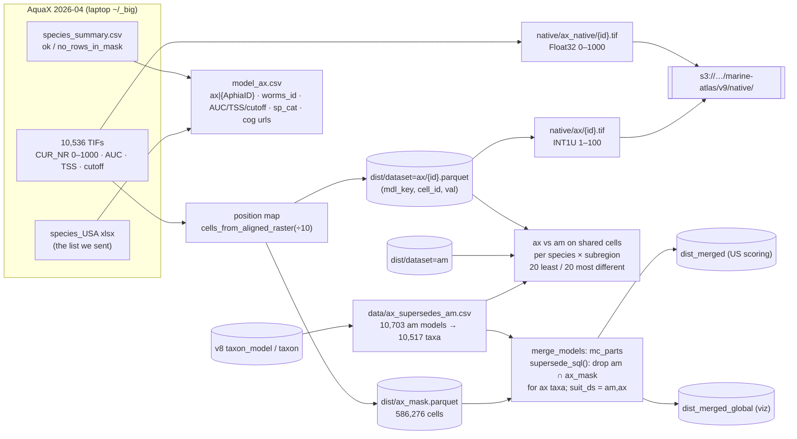

# v9 — AquaX (`ax`) preview release: ingest, AquaMaps supersession, per-species comparison

**Status:** APPROVED 2026-08-27 (all decisions as proposed; D11 reviewer = gabriel.reygondeau@miami.edu) — in progress · **Owner:** Ben · **Release:** v9 = `prerelease` /
`restricted` (reviewer-only on `preview.marinesensitivity.org/v9/…`) · **New dataset:** `ax` — AquaX
2026-04 delivery (Reygondeau et al. 2026, PLOS One, doi:10.1371/journal.pone.0335823)

AquaX is "an enhanced and revised AquaMaps framework". The delivery is 10,536 per-species
suitability rasters **already on the v8 `global05` grid**, **masked to the BOEM US study area**
(the very `ply_boem-usa.gpkg` we sent them — byte-identical to `derived/v1/ply_boem-usa.gpkg`),
keyed by WoRMS AphiaID. v9 ingests them as a new suitability dataset `ax`, lets `ax` **supersede
AquaMaps (`am`) for the same taxon wherever AquaX was modeled**, publishes every TIF as a COG in
the marine-atlas, and — in the ingest notebook itself — quantifies what changed per species so
reviewers can inspect the differences in the species app.

## Facts established (2026-08-27) — measured, not assumed

| fact | value | how |
|---|---|---|
| TIFs | **10,536** in `SDM/MBON_USA_BOEM_masked_emmean_matched_species_TIF_TIF/BOEM_MASKED_EMMEAN_SP_{AphiaID}.tif`, 15.1 GB, 1.3–2.5 MB each (DEFLATE, 256² tiles, no overviews) | `ls`, `gdalinfo` |
| geometry | 7200×3600, 0.05°, origin (−180, 90), EPSG:4326 — **same shape as `r_cellid_global.tif`**; extents differ by 6e-6° (the cell-id COG's float drift). At every non-NA pixel `cellid == pixel index` → **`cell_id` is the pixel position, no resample** | terra on SP_103278 |
| bands | 1 `CUR_NR` Float32 suitability **0–1000** (present-day, cropped to the species' biogeographic range); 2 `AUC`, 3 `TSS`, 4 `cutoff` (TSS threshold, e.g. 460) — bands 2–4 are one constant per model. NoData −9999. Observed minimum ≈47–59 (AquaX already drops low values) | `gdalinfo`, `values()` |
| mask | the most-covered model has **586,276** cells: 580,390 `in_usa`, 5,886 ocean-not-`in_usa` (edge of the polygon rasterization), 0 land. **53,818 `in_usa` cells (8.5% of 634,208) are never covered** — deep water (mean depth 1.4 km), lon −163…−177 (Aleutian / NW-Hawaiian sector) | cell table join |
| request list | `species_USA_2025-10-29_worms-only.xlsx`: 16,873 v7 taxa (`worms:` ids only — no birds), component counts coral 775 · fish 6,672 · invertebrate 8,179 · mammal 88 · other 1,128 · reptile 31 | readxl |
| AquaX run | `..._species_summary.csv`: 13,278 species attempted → **10,536 `ok`** (TIF written) + **2,742 `ok:no_rows_in_mask`** (modeled, but no present-day cells inside the US mask → no TIF) | csv |
| overlap with v8 | of the 10,536: **10,521** match a v8 WoRMS taxon; **10,517** have a v8 `am` model → **10,703 `am` models superseded** (182 taxa carry >1 AquaMaps model); 4 are range-only in v8; **15** are absent from v8's `taxon_model` (new taxa). Of the 2,742 no-presence species, 2,738 have a v8 `am` model | v8 `sdm.duckdb` |
| by component (v8 `sp_cat`) | ax-ok taxa: coral 603 · fish 4,520 · invertebrate 5,327 · mammal 65 · turtle 6 (all 6 SWOT turtles). v8 `am` taxa **not** modeled by AquaX (keep `am`): fish 1,637 valid-US + 3,749 non-US, invertebrate 4,041 + 2,630, coral 122 + 285, primary_producer 290 + 47, mammal 7 + 45 | v8 `taxon` |
| volume | 726 M cells across all ax models (mean 68,922/species) → ~3 GB Parquet; COGs ≈ 2 × 10.5k ≈ 6 GB; laptop has 379 GB free | csv, `df` |
| `ax_mask` vs `in_usa` | AquaX's own ocean mask, not ours: the gap is deep Aleutian/NWHI water, not nearshore — the delivery DOES include the nearshore | cell join |

Two things this settles about the design: **`ax` is a US-only surface** (unlike global `am`), so the
global viz surface must keep `am` outside the mask; and **AquaX's extent is its own mask** (586k
cells), not `in_usa` (634k), so supersession must be scoped to where AquaX actually modeled.

## Decisions (proposed defaults — confirm or change before Phase 1)

| # | decision | proposed | why / alternative |
|---|---|---|---|
| D1 | value scale | `val = CUR_NR / 10` → **[0,100]**, 1 decimal, like `am` (`probability × 100`) | the merge is `max(er, suit)` and turtles are `er × suit / 100`; a 0–1000 surface would dominate both. Original 0–1000 is preserved in the native COG |
| D2 | TSS `cutoff` | **not applied** by default (continuous, like `am`); recorded in `model_ax.csv` + COG metadata; `AX_APPLY_CUTOFF=1` zeroes `CUR_NR < cutoff` | AquaMaps was never thresholded in MST; AquaX's own richness product IS (`CUR_NR_gt_cutoff`). Ask the AquaX team during review |
| D3 | supersession extent | **`ax_mask`** = union of every AquaX-modeled cell (586,276), persisted as `dist/ax_mask.parquet`; `am` is dropped for an ax taxon **only inside `ax_mask`** and continues outside (incl. the 53,818 uncovered US cells and the whole non-US range) | "AquaX supersedes AquaMaps where AquaX was modeled." Using `in_usa` would silently blank 8.5% of US cells for 10.5k species |
| D4 | the 2,742 "modeled, no US presence" species | **keep `am`** for them in v9 (nothing to supersede), list them in the notebook by component; `AX_ABSENT_SUPERSEDES=1` drops their `am` inside `ax_mask` | conservative for the first preview; it is exactly the question reviewers should answer (AquaX absent vs AquaMaps present) |
| D5 | which surfaces | supersession applies to **both** the global viz surface and the US scoring surface | so the merged COG a reviewer sees inside US waters is what was scored; outside the mask the global COG stays `am` |
| D6 | COG representations | mirror `am`: **`native/ax_native/{id}.tif`** = band 1 as delivered (Float32 0–1000, cropped to data bbox, AUC/TSS/cutoff as GDAL metadata) and **`native/ax/{id}.tif`** = the model surface (INT1U 1–100 from the Parquet) | zero app change: the species app's Original/Interpolated toggle already keys on `representation` |
| D7 | COGs built in the ingest | yes (`AX_COG=1`, upload `AX_COG_S3=1`), URLs recorded in `model_ax.csv`; `publish_native.qmd` only **registers** them (no repaint) | the native IS the model grid — same pattern as `nc`'s in-repo COGs + `cog_url` column |
| D8 | new taxa | the 15 AquaX taxa absent from v8 are ingested; they resolve by AphiaID and score via the suit-only branch (raw `ax ∩ US`) | they were on the list we sent |
| D9 | titiler | **no `titiler-v9`**. `titiler-v8` is the stock `/cog` tiler for every release (apps hardcode it); the release notebook's `titiler-{ver}` rebuild becomes `TITILER_SERVICE` (default `titiler-v8`) and the smoke test hits `/cog/info` of a v9 merged COG | the factory is retired; a per-version service would be an empty ritual + a compose/Caddy/DNS edit |
| D10 | `mdl_id` | fresh `dense_rank` for v9 (never shipped → `published = NULL`) | partitions are per version; nothing published can renumber |
| D11 | reviewers | `PREVIEW_REVIEWERS_V9` = `ben@oceanmetrics.io,timothy.white@boem.gov,gabriel.reygondeau@miami.edu` (confirmed) | Ben's call; a new restricted version mints two Access applications → new `CF_ACCESS_AUD` line → `DEPLOY_CADDY` |
| D12 | where it runs | ingest, merge, score, publish on the **laptop** (it has AquaX + v8 `dist/`); the server needs nothing from the TIFs (COGs go to S3, tables/serve come down from S3) | the server has no AquaX copy; hydrating 15 GB to `/share` buys nothing |
| D13 | `versions.csv` row | `v9,prerelease,restricted,<publish date>,AquaX supersedes AquaMaps in US waters` | `released` = the day `versions.json` is published; `latest.txt` stays v7 (no `PROMOTE_LATEST`) |

## Design



The merge rule stays `max(er, suit-at-range)` / raw suit for suit-only taxa / `er × suit` for turtles —
only **which dataset supplies `suit` at a cell** changes: `ax` inside `ax_mask` for an ax taxon,
`am` everywhere else. That is one filter on the merge input, expressed as `msens::supersede_sql()`
and unit-tested, not a new branch in `merge_sql()`.

---

## Phase 0 — bootstrap v9 (the "new version" checklist, made reproducible)

`ver` has only ever moved once (v7→v8) and that rewrite rebuilt everything. A version bump on the
same grid must **reuse** the unchanged ingests, and several readers of `ver_prev` still assume
v7's schema. Files: `libs/paths.R`, `data/versions.csv`, new `bootstrap_version.qmd`,
`build_cell_grid.qmd`, `score_zones.qmd`, `merge_models_prep.qmd`, `build_zone_cells.qmd`.

1. `libs/paths.R`: `ver <- "v9"`, `ver_prev <- "v8"`; add `ax_dir <- glue("{dir_data}/AquaX_2026-04")`
   (+ `ax_tif_dir`, `ax_summary_csv`, `ax_xlsx`).
2. `data/versions.csv`: the v9 row (D13). `build_version_manifest.qmd` asserts `ver %in% versions$ver`.
3. **`bootstrap_version.qmd`** (`workflow_type: grid`, `dependency: []`, output
   `data/manifests/bootstrap_version.json`; `build_cell_grid.qmd` gains `dependency: [bootstrap_version]`):
   - clone `{dir_big}/{ver_prev}/marine-atlas/dist/dataset=*` + `model_*.csv` into `{dir_big_v}/marine-atlas/dist/`
     with **APFS clonefile** (`cp -c`, instant, 0 bytes) on macOS / hardlinks (`cp -al`) on Linux; skip
     datasets named in `BOOTSTRAP_SKIP_DS`; resumable (skips existing). Default verification = file
     count + byte total per dataset against `ver_prev`; `BOOTSTRAP_VERIFY=1` re-hashes with
     `msens::hash_parquet()` and asserts equality with each `data/manifests/ingest_*.json`
     `content_hash` — proof the clone is the checkpointed surface, not a stale one.
   - the ingests then **resume** against the clone (every Parquet present → seconds), so their
     content-addressed manifests are unchanged and nothing downstream re-runs for the wrong reason.
   - record what was cloned (dataset, n files, bytes, method) in the manifest stats.
4. `build_cell_grid.qmd`: `need_build` also fires when `sdm_db` lacks a `cell` table. Resume path when
   `cellid_tif` exists and `ver_prev`'s `sdm.duckdb` has `cell`: `ATTACH` + `CREATE TABLE cell AS SELECT *`
   (seconds) and assert `hash_query(cell)` equals `data/manifests/build_cell_grid.json`; else rebuild.
   Today a fresh version directory would leave v9's `sdm.duckdb` with **no `cell` table** and every
   `stopifnot("run build_cell_grid first")` downstream would pass anyway (the file exists).
5. `score_zones.qmd` `v7_cat`: reads `v7.taxon.is_ok` — v8's `taxon` has `is_valid_usa`/`is_marine`, no
   `is_ok`. Resolve with `msens::sdm_cols(con)` (`valid` column) and keep the column name `in_v7` →
   rename to `in_prev` (the docs/validate read `in_v7`? — grep and keep an alias if so).
6. `merge_models_prep.qmd` "reuse v7's taxon resolution": selects `worms_id` from `ver_prev` — v8's
   `taxon` carries `taxon_authority` + `taxon_id`. Derive `worms_id = taxon_id WHERE taxon_authority='worms'`
   when the column is absent (`sdm_cols`-style introspection).
7. `build_zone_cells.qmd` gate: for a version with no released `zone_cell` (v9), gate the extraction
   against **`ver_prev`'s** released `zone_cell` on the same grid instead of printing "skipped" — the
   extraction is grid×geometry, so it must reproduce v8's byte for byte.
8. `build_registry.qmd`: inherits dataset metadata from `ver_prev`'s `dataset` — v8 already spells `am`,
   the `am_0.05` rename is a no-op. Fine as is.
9. `score_zone_metrics.qmd` / `build_app_support.qmd`: read `ply_programareas_2026_v8.gpkg` from
   `derived/v8/` — present. Fine as is.

**Verify:** `tar_visnetwork()` shows `bootstrap_version → build_cell_grid → ingests`; a `tar_make("ingest_aquamaps")`
on the clone finishes in seconds with the same `content_hash`; v9 `sdm.duckdb` has `cell` with
`n_usa = 634,208`.

## Phase 1 — `msens` 0.37.0 (rules first, tests in the same change)

Files: `../msens/R/{grid,merge,taxa,ingest,publish}.R`, `tests/testthat/test-{grid,merge,taxa,ingest,publish}.R`,
`DESCRIPTION`, `NEWS.md`. The server converges on msens `main` at container start (2026-08-27), so no
Dockerfile pin moves; the exports assertion list is unaffected (apps call nothing new).

1. `grid.R`: `.GRID_VER["v9"] <- "global05"` + test. (Kept explicit and fail-closed; a "v8+ → global05"
   rule is tempting but the docstring's reason for erroring on unknown versions still stands.)
2. `merge.R`:
   - `merge_sql(suit_ds = c("am", "ax"))`: every `ds_key <> 'am'` / `= 'am'` becomes `NOT IN (…)` / `IN (…)`;
     `taxon_flags.has_am` → `has_suit`. `turtle_sql(suit_ds = c("am","ax"), …)` accepts a vector.
   - **new `supersede_sql(superseding = "ax", superseded = "am", mask = "ax_mask", taxa = "supersede")`** →
     a `WHERE NOT (ds_key = 'am' AND ms_merge_key IN (SELECT ms_merge_key FROM supersede) AND cell_id IN
     (SELECT cell_id FROM ax_mask))` fragment applied once, where `mc_parts` is written. Documented with the
     same care as `merge_sql` (why the mask, why both surfaces, why taxon-level not cell-level coalesce).
   - fixtures in `test-merge.R` (US cells 1–5, `ax_mask` = {1,2,3}): `T_ax_both` (range + am + ax: cell 1–3 →
     `max(er, ax)`, cell 4–5 → `max(er, am)`, non-US → am, on BOTH surfaces), `T_ax_only` (no range: raw ax
     inside mask, raw am∩US outside), `T_ax_absent` (in the no-presence list: unchanged unless the D4 flag),
     `T_ax_new` (ax, no am, no range → raw ax), `T_turtle_ax` (`er × ax` inside mask, `er × am` outside), and
     **every existing fixture unchanged** (am-only / both-masked / no_eez / multi-am must produce identical
     output with `suit_ds = c("am","ax")` — the regression guard for 6,000+ taxa that keep AquaMaps).
3. `taxa.R`: **`sp_cat_from_taxonomy(kingdom, phylum, class, is_botw, is_turtle)`** — the `case_when`
   lifted verbatim out of `merge_taxon.qmd` (bird/mammal/reptile/amphibian/fish/coral/primary_producer/
   invertebrate). `merge_taxon` calls it; `ingest_aquax` calls it for the by-component tables *before* a
   merge exists. One test row per branch.
4. `ingest.R`: **`cells_from_aligned_raster(tif, cellid_tif, band = 1, scale = 1, min_value = 1)`** —
   asserts identical dims and extent within 1e-4°, returns `(cell_id = pixel index, val)`; no resample, no
   land mask. This is the "AquaX needs no projection" path `build_cell_grid.qmd` promised and
   `cells_from_raster()`'s docstring mentions. Test on a 4×4 synthetic pair.
5. `publish.R`: **`cog_from_tif(src, out, band = 1, crop = TRUE, metadata = list())`** — `gdal_translate
   -of COG` (DEFLATE, NEAREST overviews, 256 blocks, `-b`, `-projwin` to the data bbox, `-mo KEY=VAL`) for the
   native representation; keeps the delivered values bit-exact. Test: round-trip 5 pixels.
6. `NEWS.md` 0.37.0 bullets: v9 grid; `merge_sql(suit_ds)`; `supersede_sql`; `sp_cat_from_taxonomy`;
   `cells_from_aligned_raster`; `cog_from_tif`. `devtools::test()` green → `devtools::install()`.

## Phase 2 — `ingest_aquax.qmd` (the deliverable notebook)

```yaml
title: "Ingest AquaX → global 0.05° cells (position-mapped) · supersedes AquaMaps in US waters"
msens:
  target_name: ingest_aquax
  workflow_type: ingest
  dependency: [build_cell_grid, ingest_aquamaps]      # the comparison reads am's dist/
  output: data/manifests/ingest_aquax.json
  dataset: {ds_key: ax, response_type: suitability, source_authority: AquaX, temporal_interval: static,
            native_format: raster, name_short: "AquaX (suitability)", name_display: "AquaX",
            description: "Ensemble habitat suitability (present day, cropped to the species' biogeographic range) from the AquaX framework, delivered on the 0.05° grid masked to US waters",
            value_info: "habitat suitability 0–100 (delivered 0–1000 ensemble mean ÷ 10)",
            regions: "US waters (BOEM study-area mask)", is_mask: false,
            citation: "Reygondeau G, Egorova Y, Boerder K, Tittensor DP, Kaschner K, Kesner-Reyes K, Bailly N, Cheung WWL (2026) AquaX… PLOS One 21(2): e0335823",
            link_info: "https://doi.org/10.1371/journal.pone.0335823", env_end: "2025-02"}
```

Flags (`libs/vars.R`): `REDO_INGEST` (generic), `AX_WORKERS` (default 6), `AX_TEST_N` (smoke: first n),
`AX_COG=1` (build COGs), `AX_COG_S3=1` (upload), `AX_APPLY_CUTOFF` (D2), `AX_ABSENT_SUPERSEDES` (D4).

Chunks, in order — each ends in a check that the previous behaviour would fail:

1. **setup** — paths, flags, `stopifnot(dir_exists(ax_tif_dir), file_exists(ax_summary_csv, ax_xlsx, cellid_tif))`.
2. **source inventory** — summary CSV + xlsx; assert every `ok` row's TIF is on disk and the count is
   10,536; tables: status × count, xlsx component counts; `md5(ax_dir/ply_boem-usa.gpkg) == md5(ply_usa_gpkg)`
   (the mask is our polygon); alignment: dims equal, extent within 1e-4°, and on one TIF
   `cellid[non-NA] == which(non-NA)` — the position-map premise, asserted.
3. **crosswalk → `model_ax.csv`** — `mdl_key = msens::mdl_key_raw("ax", AphiaID)`, `sp_id`, `worms_id`,
   `scientific_name` (WoRMS `spp.duckdb` by AphiaID, fallback xlsx `scientific`), `common_name`, `ax_status`,
   `component_xlsx`, `sp_cat` (`msens::sp_cat_from_taxonomy` on WoRMS class/phylum/kingdom; turtles from the
   SWOT list), and after the loop: `auc`, `tss`, `cutoff`, `n_cells`, `val_min`, `val_max`, `rows_in_mask`,
   `cog_url`, `cog_native_url`, bbox. The **no-presence** rows (2,742) are in the CSV with
   `ax_status = "absent_in_mask"` and no `mdl_key` surface — visible, not dropped.
4. **ingest loop** (furrr, resumable) — per TIF: `cells_from_aligned_raster(band 1, scale = 0.1)` →
   `msens::write_atlas_parquet(tibble(mdl_key, cell_id, val), dist/dataset=ax/{AphiaID}.parquet)`; read one
   non-NA pixel of bands 2–4 for AUC/TSS/cutoff; accumulate the **`ax_mask`** union (a logical over
   25.9 M cells, written once as `dist/ax_mask.parquet`). `AX_APPLY_CUTOFF` zeroes `CUR_NR < cutoff` before
   scaling.
5. **verify** — schema `(mdl_key VARCHAR, cell_id INTEGER, val DOUBLE)`, `val ∈ [0.1, 100]`, every ax cell
   ∈ `cell` (ocean) and ∈ `ax_mask`; the mask report: n cells, `in_usa` share, the **53,818 uncovered US
   cells** with a small map (terra plot) and their depth/longitude profile — so a reviewer can see that
   the gap is deep Aleutian/NWHI water, not the coast.
6. **COGs** (`AX_COG=1`) — native: `msens::cog_from_tif(band 1, metadata AUC/TSS/CUTOFF)` →
   `native/ax_native/{id}.tif`; model: `msens::publish_cog(cell_id, val, INT1U, nodata 0)` →
   `native/ax/{id}.tif`; both resumable, furrr. `AX_COG_S3=1` → `aws s3 sync` to `{s3_ver}/native/ax_native`
   and `native/ax` (new keys under v9 — no `/vsicurl` header-cache issue, but the CLAUDE.md rule still
   holds if any are ever repainted). **Check:** 20 random (model, cell) pairs read back from the model COG
   equal the Parquet `val` (rounded); 20 from the native COG equal the source TIF.
7. **supersession** — from `ver_prev`'s released `taxon_model` + `taxon` (local `{dir_big}/v8/tables/*.parquet`,
   fallback path-style S3): every `am|…` model whose WoRMS `taxon_id` ∈ ax AphiaIDs →
   **`data/ax_supersedes_am.csv`** (committed, reviewable; ~10.7k rows): `am_mdl_key, ax_mdl_key, taxon_id,
   scientific_name, sp_cat, ax_status, n_am_models, is_valid_usa_v8`. Tables: by `sp_cat` × {ax modeled,
   ax modeled-absent (D4), v8 `am` not modeled by AquaX, ax new to v8}; the 182 multi-AquaMaps-model taxa.
   Assert the headline numbers (10,703 / 10,517 / 182 / 15) — they are known now, so a drift is a bug.
8. **comparison** (the requested statistics) — for each superseded `(am_mdl_key, ax_mdl_key)` pair, join
   the two Parquet surfaces on `cell_id` within `ax_mask ∩ in_usa`, batched by ~500 species (the am files
   are per species; ~25 GB read, filtered to US on the fly), tagged with subregion from
   `zones/subregion_2025-06/global05/zone_cell.parquet` (AK / AT / GA / PA):
   - per species × region and overall: `n_shared` (both present), `n_am_only`, `n_ax_only`, footprint
     Jaccard, `mean_am`, `mean_ax`, **`delta = mean_ax − mean_am` on shared cells**, `cor` on shared cells;
   - written to `dist/ax_vs_am.parquet` (all rows) and **`data/ax_vs_am_summary.csv`** (per species overall +
     4 regions wide; committed);
   - rendered: summary by `sp_cat` (n species, median Δ, mean |Δ|, % with AquaX lower, median Jaccard),
     the same by region, a scatter `mean_am` vs `mean_ax`, and the **20 least + 20 most different
     species** (by |Δ| overall on shared cells; ties by Jaccard), each row linking to the species app on
     the preview host — `msens::preview_app_url("species", "v9")` + `?mdl_key=ms_merge|WORMS:{id}` — where
     the Merged / AquaMaps / AquaX inputs are side by side (the app already resolves a `?mdl_key=` that
     names a raw input, so `?mdl_key=ax|{id}` works too).
   - multi-`am` taxa: one row per `am` model **and** a taxon-level aggregate (max-merge of its am models
     first), so the table matches what the merge actually compared against.
9. **manifest** — `hash_parquet(dist/dataset=ax/*.parquet)`; stats: n_models, n_cells, mask counts,
   n_superseded, median |Δ|, n_cog.

**Runtime (laptop, 6 workers):** TIF → Parquet ~20 min; COGs ~1 h; S3 sync ~15 min; comparison ~45 min.
Prototype with `AX_TEST_N=50 AX_COG=1` end-to-end (Parquet → COG → merge fixture → app) before the full run.

## Phase 3 — pipeline integration

- **`merge_models_prep.qmd`**: `lookup` picks an optional `worms_id` column from `model_*.csv` and
  short-circuits name matching for those rows (ax resolves by AphiaID, never by name — the
  `aquamaps_worms_duplicate_preferred.csv` class of bug cannot reach it). Assert no ax model is re-keyed
  to BOTW. `taxon_flags` is built in `merge_models` (below). `dependency:` adds `ingest_aquax`.
- **`merge_models.qmd`**: `suit_ds <- c("am","ax")`; register `ax_mask` (from `dist/ax_mask.parquet`) and
  `supersede` (from `data/ax_supersedes_am.csv`, `ax_status == "ok"` plus the D4 flag) in `merge.duckdb`;
  the `mc_parts` write applies `msens::supersede_sql()` (fresh v9 dir → runs; `REDO_MC_PARTS=1` otherwise);
  `taxon_flags.has_suit`; turtles via `turtle_sql(turtle_ds, suit_ds, …)`. **New check** beside the
  masking check: for every superseded taxon, no `am`-valued cell survives inside `ax_mask` in either
  surface — a query the v8 behaviour fails.
- **`merge_taxon.qmd`**: `sp_cat` via `msens::sp_cat_from_taxonomy()`; nothing else changes (`n_global`,
  `is_valid_*`, `is_marine` are dataset-agnostic).
- **`build_registry.qmd`**: `ds_order` gets `ax` after `am`; `fm_dataset()` reads the richer optional keys
  (`name_short`, `name_display`, `description`, `citation`, `link_*`, `value_info`, `regions`, `taxa_groups`,
  `is_mask`, `env_start/env_end`) because a **new** dataset has no `ver_prev` row to inherit from — today
  it would be labelled "AquaX (suitability)" by the glue fallback and carry no citation into the docs.
  `is_scored` introspects TRUE for both `ax` and `am` (am still feeds ~6,000 taxa). `mdl_id` fresh (D10).
- **`publish_native.qmd`**: an `ax` registry chunk builds both representation rows from `model_ax.csv`
  (`asset_url`, bbox, `rescale 1–100` model / `0–1000` native, `colormap spectral_r`) for the served set;
  no painting; `registry_merge()` sees two new classes (`ax|cog|native`, `ax|cog|model`). Run with
  `PUBLISH_MERGED_COG=1` (mandatory — the merged COGs of 10.5k taxa change) — fresh v9 dirs, so no
  `REDO_*` needed; `NATIVE_SKIP_PMTILES=1` is fine once the vector datasets' PMTiles are copied from v8
  (they are byte-identical; bootstrap clones `native/pmtiles` too, or let it rebuild ~1 h).
- **`release_marine-atlas.qmd`**: `TITILER_SERVICE` (D9) replaces `titiler-{ver}` in the compose rebuild;
  smoke test → `GET {titiler}/cog/info?url=<a v9 merged COG>`; everything else is already `{ver}`-driven
  (`/share/data/big/v9/…`, STAC child link, `DEPLOY_TABLES`, `DEPLOY_ACCESS`, `CHECK_PREVIEW` loops every
  restricted version so v9 is probed automatically).
- **`build_version_manifest.qmd`**: nothing beyond the CSV row; **no `PROMOTE_LATEST`**.
- `publish_score_cogs.qmd`, `publish_stac_api.qmd` (enumerates `native_asset.ds_key` → `ax` collection
  appears), `publish_storage_index.qmd` (v9 restricted → excluded from the public index by the existing
  rule), `build_app_support.qmd`, `build_zone_sets.qmd` (server scan adds v9 to `versions`): no change.
- **`../server`**: `.env` gains `PREVIEW_REVIEWERS_V9` and, after `access.sh`, the new `CF_ACCESS_AUD`
  entries → `DEPLOY_CADDY=1`. No compose change (D9). `caddy/test/run.sh` `TEST_VER` stays v8.
- **`../docs`**: `data/release_notes.yml` v9 entry (datasets / methods / scope / technology / zones);
  `data-sources.qmd` "Notes on individual sources → AquaX" (the supersession rule, the mask, ÷10, cutoff
  not applied, the coverage gap); `references.bib` `reygondeau2026`. CI reads `versions.json` → renders v9
  to `gh-pages-preview` on the next push.
- **`../apps`**: expected **zero code change**. Verify on the preview host: dataset label "AquaX" in the
  input list; Original (0–1000 Float32) / Interpolated (1–100) toggle; click value; fit-to-bbox; deep link
  `?mdl_key=ax|137092`. If the label shows `ax`, the front-matter keys did not reach `dataset` — fix the
  registry, not the app.
- **`CLAUDE.md`**: pipeline line (`ingest_aquax`), the supersession paragraph (D3/D5 in two sentences),
  the "titiler-v8 serves every release" note, v9 status line, the `ver_prev`-schema traps from Phase 0.

## Phase 4 — validation gates (rule-level first, then aggregate)

1. `Rscript -e 'devtools::test("../msens")'` green (Phase 1) **before any render**.
2. Ingest self-checks (Phase 2 chunks 2, 5, 6, 7): alignment, mask, COG round-trip, headline counts.
3. Merge checks: the existing masking check + the new "no `am` inside `ax_mask` for superseded taxa".
4. **Control run — the check that cannot pass by accident**: render the merge/score chain once with
   `AX_SUPERSEDE=0` (ax ingested and registered, but `supersede` empty). `pra_score_delta(v9, v8,
   zone_set_key = "programarea_2026-01")` must show **cor = 1.000, max |Δ| = 0** — proving the bootstrap
   clone, the `suit_ds` generalization and the `ver_prev` fixes moved nothing. Then the real run.
5. Real run: `pra_score_delta(v9, v8)` will **diverge by design** (10.5k of ~16k valid-US species change
   surface inside the mask). The gate is "explained": the per-component / per-region Δ tables from the
   ingest comparison are the explanation, and `validate_versions.qmd` (`render_versions("v8","v9")`)
   is committed with it. Expect fish/invertebrate/coral components to move, mammal slightly, turtles
   via the multiplicative rule; bird, primary_producer, and every non-AquaX-modeled taxon unchanged —
   assert the last two (cor ≥ 0.999 on their components).
6. `dataset.is_scored`: `am` TRUE, `ax` TRUE, `gm`/`nc` FALSE.
7. `build_registry`: `mdl_id` fresh, `taxon_model` has `ax` edges = 10,536 (minus any invalid).
8. `CHECK_PREVIEW=1`: v9 restricted — public host falls back, preview `/v9/scores/` renders `ms-ver=v9`,
   the v8 probe token cannot open v9 and vice versa.

## Phase 5 — release + preview deploy (order matters)

Laptop (`quarto render` / `tar_make`, in DAG order): `bootstrap_version` → `build_cell_grid` → ingests
(resume) → `ingest_aquax` (`AX_COG=1 AX_COG_S3=1`) → `merge_models_prep` → `merge_models` → `merge_taxon` →
`score_zones` → `score_cell_metrics` → `score_zone_metrics` (gate) → `build_registry` → `publish_native`
(`PUBLISH_MERGED_COG=1`) → `publish_score_cogs` → `release_marine-atlas` (first `RELEASE_NO_S3=1` to stage
and inspect, then the S3 push) → `build_version_manifest` (v9 restricted; `versions.json` **published
before** any reader is deployed) → `publish_stac_api` → `publish_storage_index`.

Server, all via `release_marine-atlas.qmd` flags: `DEPLOY_TABLES=1` (tables + local `model_cell` for v9,
~1 h) → `DEPLOY_APPS=1` (msens 0.37.0 converges at container start; the apps need no change) →
`DEPLOY_ACCESS=1` (mints the v9 applications; paste the AUDs into `.env`) → `DEPLOY_CADDY=1` → push
`docs` (CI → `gh-pages-preview`) → `DEPLOY_DOCS=1` → `CHECK_PREVIEW=1`. Commit every rendered
`_output/*.html`.

## Phase 6 — skills (`.claude/skills/`)

- **`ingest-sdm`**: add the *same-topology raster* recipe (`cells_from_aligned_raster`, multi-band scalar
  metadata, ÷scale, the persisted dataset **mask**), the *crosswalk-by-native-id* path (`worms_id` column
  short-circuits `merge_models_prep`), *COGs staged in the ingest when native == model grid* (`cog_url`
  columns → `publish_native` registers, never repaints), and the **supersession pattern**: a committed
  `data/{new}_supersedes_{old}.csv`, `supersede_sql()`, and the per-species comparison as an ingest
  deliverable. Cross-link `validate-sdm`.
- **`generate-sdm-metadata`**: the richer `dataset:` front-matter keys (a new dataset inherits nothing);
  `sp_cat_from_taxonomy()` as the single source; `is_scored` stays TRUE for a *partially* superseded
  dataset; "registered is not used" now has a third case: superseded-within-mask.
- **`validate-sdm`**: the **control run** (`AX_SUPERSEDE=0` → cor 1.000) as the template for any
  "new dataset replaces part of an old one" change; "the aggregate gate is *explained*, not near-zero";
  the "no old-dataset cell inside the new mask" assertion.
- **`publish-sdm`**: the new-version bootstrap checklist (versions.csv row, grid registry, clone from
  `ver_prev`, `mdl_id` fresh, `titiler-v8` serves every release — no `titiler-v{n}`, Access per restricted
  version → AUD → `DEPLOY_CADDY`, `latest.txt` untouched); the v9 deploy order above.
- **new `bootstrap-release`**: "Start a new MST release version" — Phase 0 as a runbook, with the list
  of readers that assume `ver_prev`'s schema (`score_zones` `is_ok`, `merge_models_prep` `worms_id`,
  `build_cell_grid` cell table, `build_zone_cells` gate) so the next bump does not rediscover them.

## Estimates

| step | wall time | disk |
|---|---|---|
| bootstrap clone (APFS) | seconds | 0 |
| `ingest_aquax` TIF → Parquet | ~20 min (6 workers) | ~3 GB |
| COGs (2 reps) + S3 | ~1 h + 15 min | ~6 GB local, ~6 GB S3 |
| comparison stats | ~45 min | 100 MB |
| `merge_models` (`mc_parts` + merge) | ~40 min + ~2 h | like v8 (v8's `mc_parts` can be deleted afterwards) |
| `merge_taxon` → scores | ~1 h | — |
| `publish_native` merged COGs | ~2 h | ~0.6 GB |
| release stage + S3 | ~1 h | — |
| server `DEPLOY_TABLES` | ~1 h (40k small files) | 3.3 GB |

## Risks / watch-items

- **US-only `ax` beside global `am`**: the merged global COG changes texture at the mask edge for 10.5k
  taxa — by design (D3/D5), and the docs note says so. The species app shows the AquaX input alone
  too, so a reviewer can see the boundary is the mask, not the species.
- **Scale comparability (D1)**: `CUR_NR` is an ensemble suitability index 0–1000; AquaMaps is a
  probability × 100. ÷10 makes the *ranges* comparable, not necessarily the *calibration* — exactly what
  the comparison tables measure. Confirm with the AquaX authors during review.
- **D4 (2,742 absent-in-mask species)** is the largest scientific choice; it is a flag, a table and a
  question, not a silent default.
- **Score drift magnitude is unknown until run**; the control run (Phase 4.4) isolates it from every
  incidental change, so any drift beyond the supersession is a bug, not a story.
- **`ver_prev` readers assuming v7** (Phase 0.5–0.7): found three by reading; a fourth may surface in a
  render — treat any `column not found` on a `v7`-attached table as this class.
- **Cloudflare**: minting two Access applications and pasting AUDs is manual (`.env` on the server);
  the runbook in `server/cloudflare/README.md` covers it. Reviewers get one-time-PIN e-mails.
- **Laptop-only inputs**: the server can never re-render `ingest_aquax` — acceptable (D12) and recorded in
  the notebook header; the outputs it needs are on S3.
- **`registry_merge` shrink guard**: a partial `publish_native` run on v9 (e.g. without
  `PUBLISH_MERGED_COG`) has no prior registry to carry forward — the first run must be complete.

## End-to-end verification (what "done" means)

- [ ] `devtools::test("../msens")` green; msens 0.37.0 installed laptop + converged on the server.
- [ ] `_output/ingest_aquax.html` shows: 10,536 models; mask 586,276 cells / 53,818 uncovered US cells
      mapped; 10,703 `am` models superseded over 10,517 taxa (182 multi); by-component tables; the
      per-region Δ tables; the 20 least / 20 most different with working preview deep links.
- [ ] S3 `marine-atlas/v9/native/ax/` and `ax_native/` hold 10,536 COGs each; `/cog/info` answers on
      titiler-v8 for both; `native_asset` has both representations for every served ax model.
- [ ] Control run cor = 1.000 / max |Δ| = 0; real run's `validate_v8_v9.html` committed with the
      explanation tables; non-AquaX components unmoved.
- [ ] `versions.json` lists v9 `prerelease`/`restricted`; `latest.txt` still v7; the manifest validates.
- [ ] Preview host: `/v9/species/?mdl_key=ms_merge|WORMS:137092` renders Merged + AquaMaps + AquaX with
      the Original/Interpolated toggle; `/v9/scores/` renders v9; `CHECK_PREVIEW` green incl. isolation.
- [ ] docs v9 book on the preview host with the AquaX source note and release entry.
- [ ] Skills updated (Phase 6), CLAUDE.md updated, plan status updated, all rendered HTML committed.

## Open questions for Ben (answer in the table above or here)

1. D1/D2 — ÷10 and no cutoff by default: agreed? (Both stay reversible via the recorded cutoff.)
2. D3 — supersession scoped to `ax_mask` (not `in_usa`): agreed?
3. D4 — keep AquaMaps for the 2,742 "modeled, absent in US" species in the first preview, or let AquaX's
   absence win (`AX_ABSENT_SUPERSEDES=1`)?
4. D11 — who reviews v9 (AquaX authors' e-mails)?
5. D13 — release title / date wording.
6. Anything else the AquaX delivery should contribute now — e.g. the `RANGEMAP` NR/CR polygons or the
   future-scenario surfaces are **not** in this delivery and are out of scope here.
