# Atlas app plan, round 3 — everything still open after round 2 (2026-09-25)

**Where things stand.** Round 2 closed on 2026-09-25 with atlas **0.10.67** live on Pages and the
review host (CI green on the three browser engines, seeded-fault suite 99/99), docs main `0b3c827`
(chapter "as of 0.10.59"), msens **0.44.1** on main and in the server container, and **all eleven
releases' `app/` bundles republished** (Program Area names, input rasters, metric labels, truthful
`cell_model` capability). The round-2 record is `plans/2026-09-23 atlas app plan, round 2.md` §11–§13
and the dated log `plans_todo/atlas-8 verification, accessibility, performance.md`; every Opus
review is under `plans_todo/atlas-refs/`. Screenshots referenced below are in
`atlas-refs/round3-shots/` (real builds, phone 390×844@2x and desktop 1280×800, dark theme).

This plan lists **every open item** with what it is, why it is still open, the evidence, and a
suggested resolution — grouped into (A) product decisions only Ben can make, (B) app defects and
nits with a known fix, (C) data / release-side gaps, (D) process and tooling debt, (E) the cutover
checklist. Items are numbered `R3-…` for reference in briefs and commit messages.

---

## A. Product decisions (Ben's calls)

### R3-A1 — Wide-range models on the phone (the leatherback)
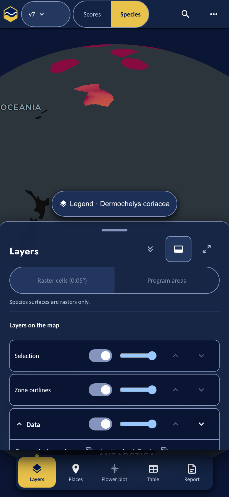

*What:* the v7 leatherback model spans the whole Pacific (SWOT DPS nesting ranges near Oceania,
foraging up to Alaska). At 390 px there is no zoom that shows it, so the projection-aware fit
(V4, MapLibre `cameraForBounds`) centres on open ocean with the northern blobs at the top limb.
The walrus and every compact model frame well (phone-18). 0.10.55's "nice" Alaska band was the old
Mercator math cropping by accident.

*Options:* (a) frame the **in-US portion** of a model first when its bbox exceeds ~120° of
longitude (the study area is what the scores are about); (b) clamp a minimum zoom and centre on
the **densest** cells (needs a cheap density probe — `/cog/point` samples or the merged COG's
statistics); (c) keep the whole-range fit and add a "Zoom to US waters" affordance. Recommendation:
(a) as the default with (c) as the escape hatch.

### R3-A2 — The phone's default first view
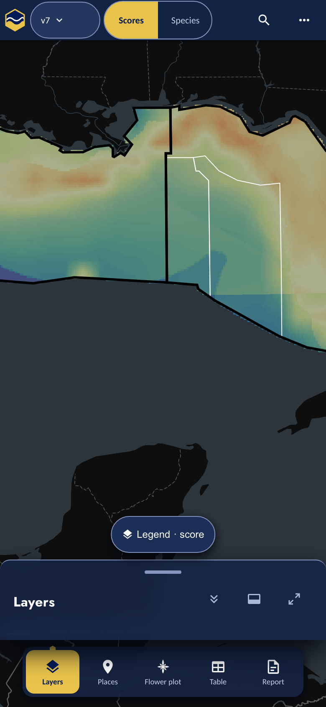

*What:* the phone opens on the northern Gulf of Mexico (P9 chose it because the desktop's whole
study-area frame put Canada in the middle of a 390 px screen). Reviewers keep noting it is one
region of four. *Options:* keep the Gulf; open on the user's nearest region if geolocation is
granted; a two-row "Alaska | Pacific | Gulf | Atlantic" chooser in the welcome modal on phones.

### R3-A3 — Component palette pairs
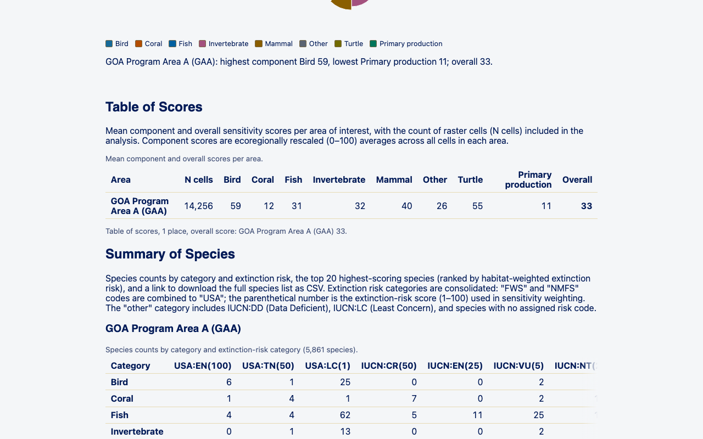

*What:* in the eight-category palette (`src/lib/ui/tokens.css` `--cat-*`), Bird `#166a99` and
Fish `#0060a0`, and Mammal `#8a5e00` and Turtle `#726b00`, are near-identical in both themes; the
report legend and flower petals inherit it. The palette is a design decision, so it was left
alone. *Options:* re-hue Fish (teal) and Turtle (olive → moss), keeping the contrast gate
(`scripts/contrast.mjs`) green; or order petals so the near pairs never sit adjacent.

### R3-A4 — "GOA Program Area A (GAA)" beside "Gulf of Alaska (GOA)"
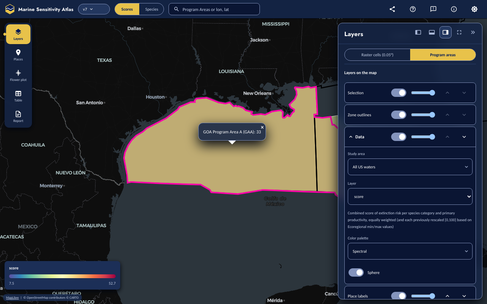

*What:* the canonical 2026 geometry names GAA "GOA Program Area A" (Gulf of America) while GOA is
the Gulf of Alaska key. The app shows the geometry's own names verbatim (V1 fallback table,
generated from `ply_programareas_2026.gpkg`). *Options:* rename in the geometry/zone-set source
("Gulf of America Program Area A") so every product agrees; or keep the official BOEM wording.

### R3-A5 — Restricted releases' `app/` objects are anonymously readable
*What:* by the notebook's original design (`build_app_bundle.qmd` lines 89–93, since its first
commit) a restricted release gets exactly the same `app/` objects as a public one, and those objects
are world-readable on S3 while the release's `tables/` are not (v9: `tables/` 403, `app/` 200; v7b's
`serve/cell_model/` likewise). The atlas never *links* to them for a restricted release without a
preview session, but the bytes are fetchable by anyone who knows the key. *Options:* accept (the
bundle carries scores at zone/cell level, not the source tables); or restrict `app/` and serve it
through the review host's signed session (`session.data` prefix — the app already supports it).

### R3-A6 — The health banner's placement
*What:* V7 moved it below the top bar inside the stage (never over interactive chrome). It covers
the map's top strip while shown. Reviewers accepted it; flagging only because it was a UX cost you
raised. No action unless you want it as a toast at the bottom instead.

---

## B. App defects and nits with a known fix

### R3-B1 — Raw metric key "score" in the Layer select, legend and chip
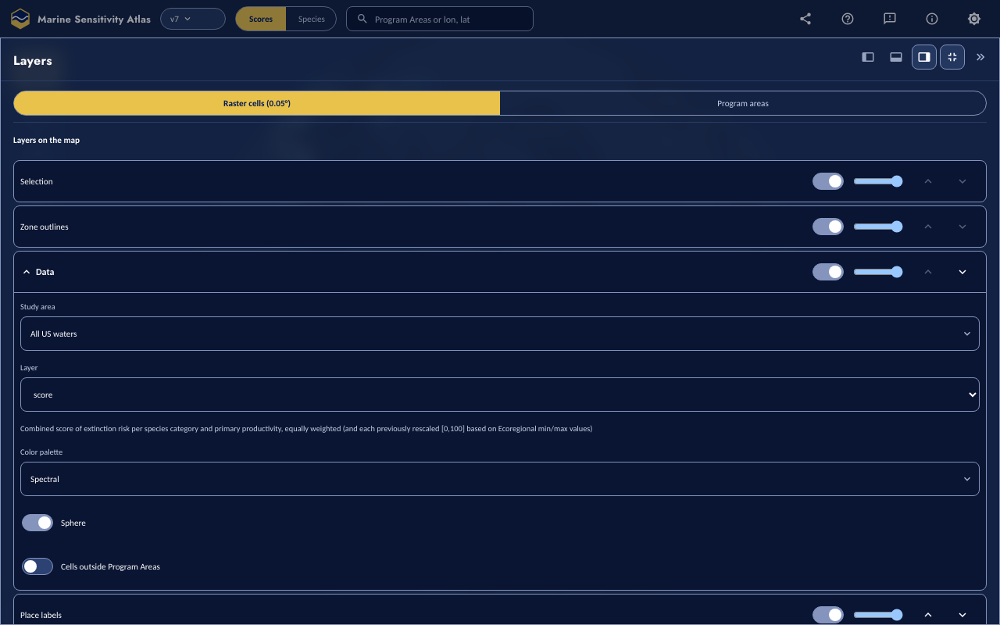

v7's own curated manifest label for the composite is the bare word `score` (the backfill never
overrides a curated label). Either recurate `layers_v7.csv` in workflows and rebuild v7's manifest
("Overall score"), or let the app title-case a bare `score` the way `categoryLabel()` does for
categories. The former fixes every consumer.

### R3-B2 — Native `<select>` for the Layer picker
Same screenshot as B1: the Layer dropdown is the browser's native select while every other control
is the app's own `Select.svelte`. Swap it for the app component (it exists; the native one predates
it) — check the phone keyboard behaviour after.

### R3-B3 — Popup vs panel coordinates, and the popup's score wrapping
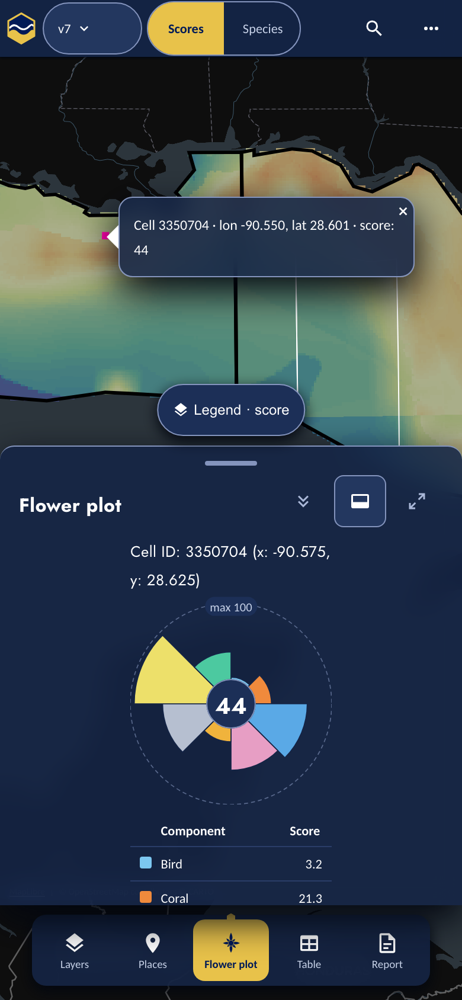

The map popup prints the **click point** (e.g. −90.550, 28.601) while the panel prints the **cell
centre** (−90.575, 28.625) for the same cell; and the popup wraps "score: 44" onto its own line.
Print the cell centre in both (the cell is the unit) and give the popup a min-width.

### R3-B4 — Welcome modal: gold focus ring on the × at load
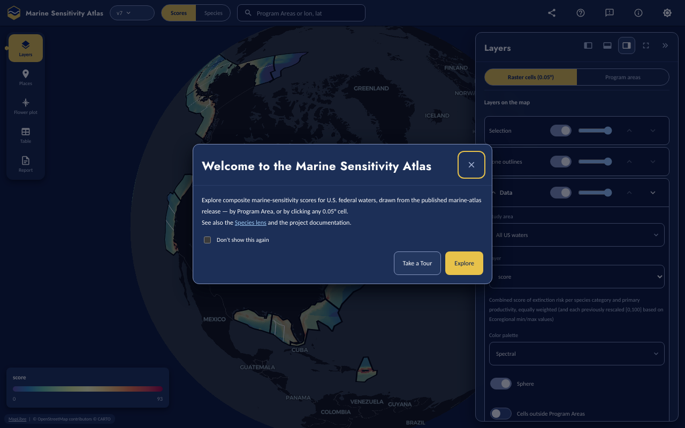

The modal focuses its close button on open, so the first paint shows a thick focus ring. Focus the
dialog container (or the primary "Explore" action) instead; keep the ring for keyboard users
(`:focus-visible`).

### R3-B5 — Legend modal: ~160 px of empty card under the ramp
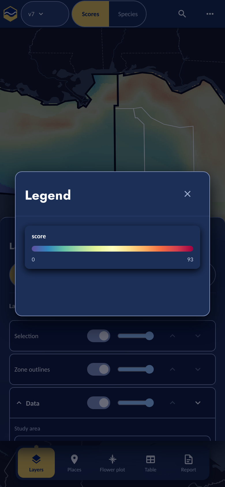

Size the modal to its content (or fill the space with the layer description the Layers panel
already has).

### R3-B6 — Places action buttons use a larger font than the panel
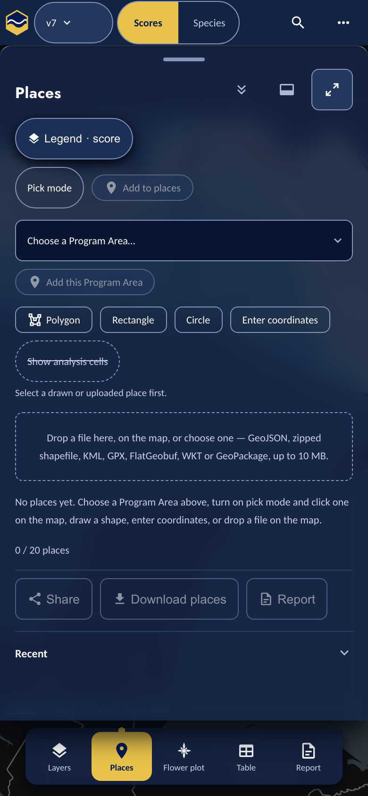

Share / Download places / Report are `Button` defaults at 1 rem while the rest of the panel is
0.9 rem. One class.

### R3-B7 — Report: the place pill is followed by the same text on its own line
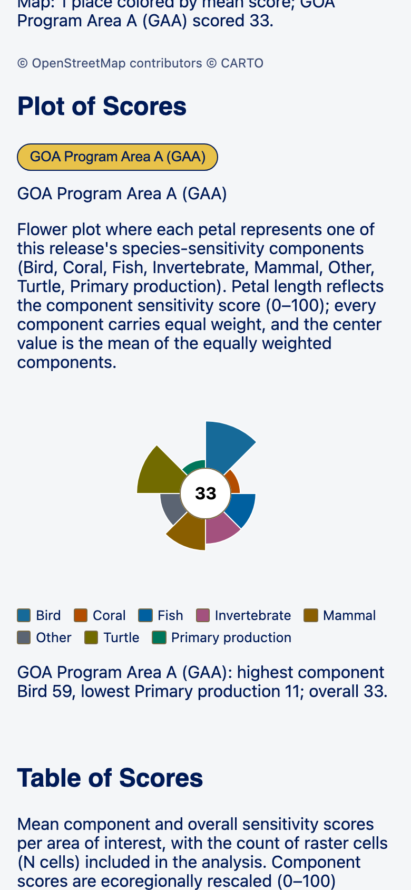

"GOA Program Area A (GAA)" appears as a pill and again as a heading line under it. Keep one (the
heading is the accessible name; the pill duplicates it).

### R3-B8 — Report citation: "as provided in this R package"
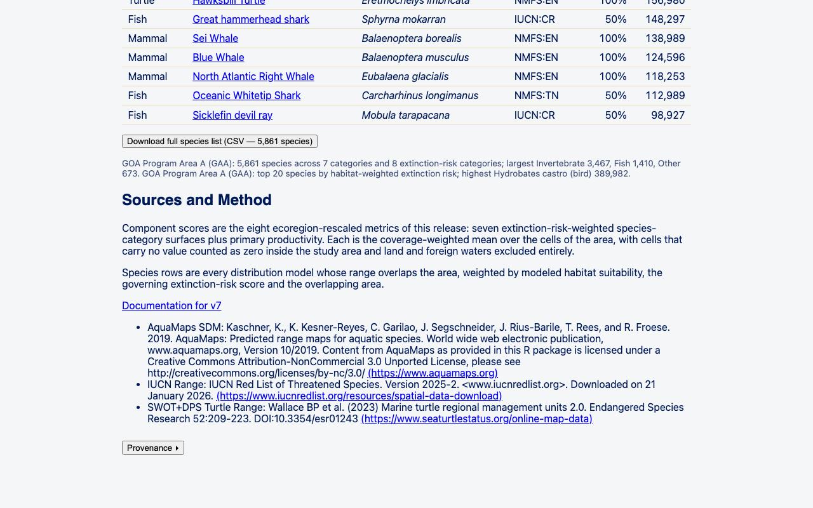

The AquaMaps citation is copied verbatim from msens's `datasets.json` where "this R package" made
sense. Fix the source text in msens (`inst/…/datasets.json`) so every consumer improves; the atlas
already has `fixKnownCitationTypos()` for display-time patches (W3) — retire that once the source
is fixed.

### R3-B9 — Desktop species table: cut filter placeholders and blank space
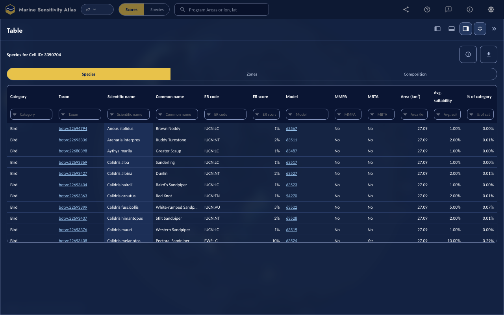

"Area (kn", "Avg. suit", "% of cat" are the column filter placeholders truncated by column width;
the table leaves ~180 px blank under itself at full screen. Shorter placeholders (or a title
attribute) and `height: 100%` for the table body.

### R3-B10 — Desktop flower panel: the "Mean" row is cut at the panel's bottom edge
Same shot as B3's desktop twin (`desktop-06-flower-half.png` in `atlas/.tmp/eyes13/`): the
component table's last row sits under the panel's bottom padding at the half width. Let the table
scroll inside the panel, or reserve the row.

### R3-B11 — Report map: "LOUISIANA" label clipped at the top edge
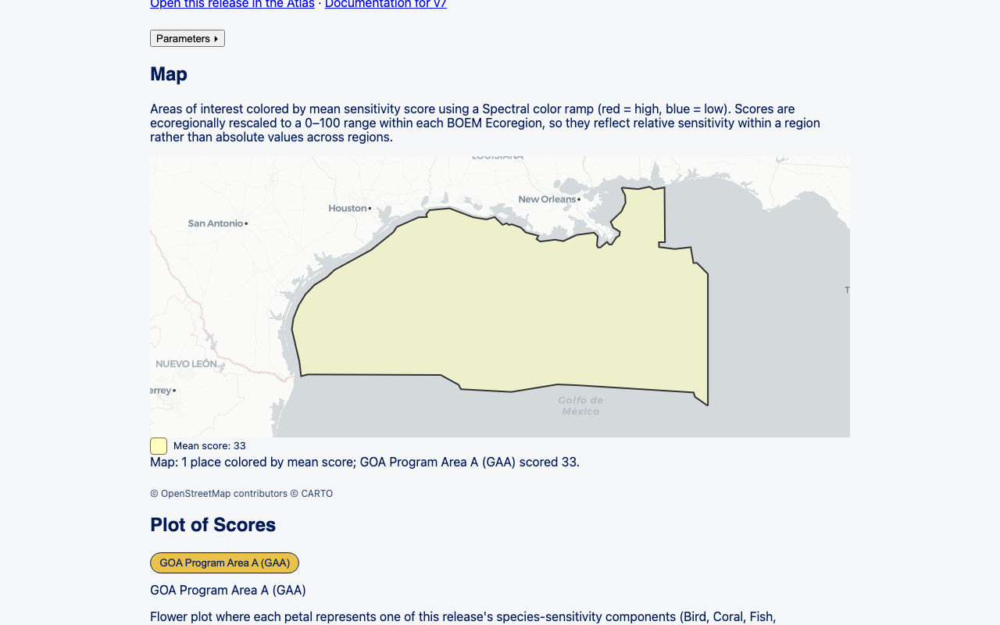

The static report map crops basemap labels at its top edge. Either pad the fit by a label height
or hide the basemap's label layer in the report map (the places are what the map is for).

### R3-B12 — The theme toggle reads as a settings gear
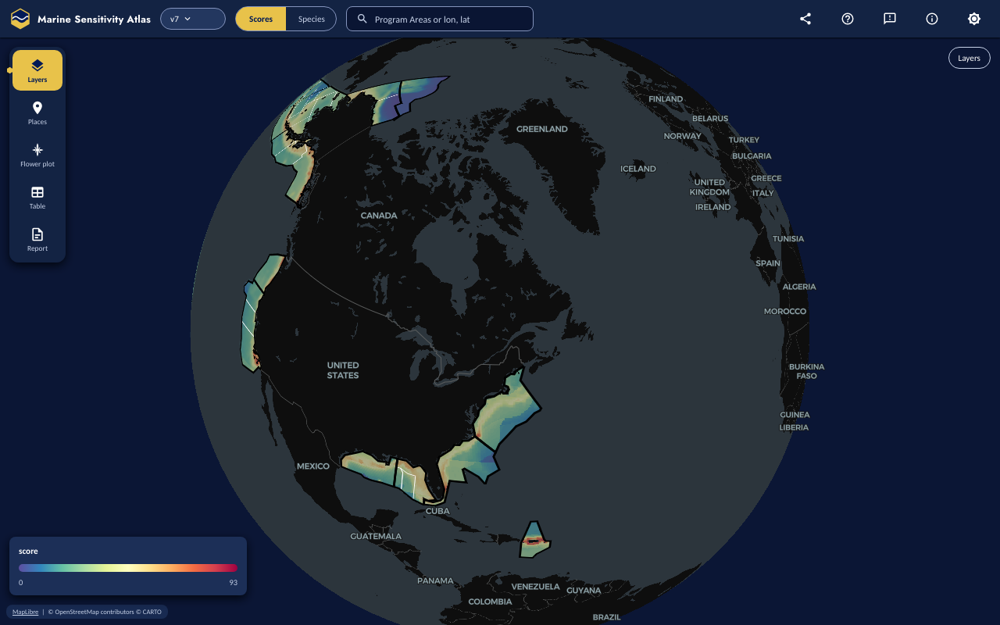

The top-right theme control uses a gear-like icon. Use sun/moon (the phone ⋯ menu already says
"Switch to light theme").

### R3-B13 — Species panel: `rng_iucn` inputs struck through on v2–v7b
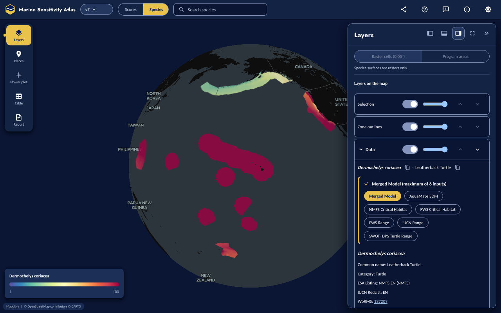

1,873 of v7's 12,120 inputs (all `rng_iucn` range models) have no `model_asset` registry row, so
they stay struck through in the Atlas *and* the Species Shiny app. This is a data gap, not a UI
bug: the fix is a `publish_native` run that registers those range PMTiles/COGs for the legacy
releases (workflows), after which the bundles republish and the pills resolve. Until then the
tooltip says "no raster registered for this model".

### R3-B14 — Scores search: matches by resolved label (done), but zone bbox needs a loaded tile
V1's `zoneBoundsFromMap()` reads `querySourceFeatures()`, which only sees tiles already loaded;
a zone far outside the current view can fall back to the announce-only path (no zoom). The bundle
could publish each Program Area's bbox in `boot.zones[].bbox` (msens `app_zones()`), making the
search zoom independent of tile state. Small msens + notebook change, then an app change to prefer
the published bbox.

### R3-B15 — `preview: false` hardcoded in `createAnalytics()`
`Shell.svelte` and `Report.svelte` construct analytics with `preview: false`, so GA4's
`content_group` is `atlas` on the review host too. The session resolver is async, so the fix is a
small `updatePreview()` on the `Analytics` interface called once `resolveSession()` settles (Q7
flagged it).

### R3-B16 — eslint should ignore `docs/*_files/`
A local Quarto render of `docs/status.md` leaves `docs/status_files/` (already gitignored) and
`npm run lint` then fails with 724 errors on bundled libraries. Add the glob to
`eslint.config.js`'s ignores.

### R3-B17 — Harness: desktop scored-cell taps and the report-map state
V5 replaced fixed pixels with projected lon/lat and V5's `13b-report-map` state frames the map
figure; review 5 still found the desktop 06/07/09/10 states depend on the default camera. Keep the
harness honest: WARN + `-MISSED` filenames (done), and add a `programarea` scores state on desktop
with the panel *collapsed* so the map tooltip is visible (review 5 could not verify the tooltip's
full name because the panel covers that spot).

---

## C. Data and release-side gaps

### R3-C1 — Register the legacy releases' `rng_iucn` assets (see B13)
`publish_native.qmd` for v2–v7b over the IUCN range models, then `scripts/render_app_bundle.sh`
for those versions. Expect the walrus-class counts to move from 10,247/12,120 to ~12,120/12,120
on v7.

### R3-C2 — Republish v7's manifest with a curated composite label (see B1)
`data/layers_v7.csv` → `build_version_manifest.qmd` (the backfill never overrides curated labels).

### R3-C3 — Publish zone bboxes in `boot.json` (see B14)
`msens::app_zones()` gains `bbox` per row (from the zone-set GeoPackage); schema
`inst/schema/app_boot.schema.json`; the notebook's R3 gate counts them; the app prefers them.

### R3-C4 — msens `datasets.json` citation text (see B8)

### R3-C5 — Bundle publish hygiene
The notebook loop leaves `data/manifests/build_app_bundle.json` (and the per-version HTML) modified
in the working tree; commit them after every publish run **before** merging a notebook branch, or
the merge aborts (it did on 2026-09-25 and my log line briefly claimed a merge that had not
happened). `PUBLISH_PLAN.md` should say so.

---

## D. Process and tooling debt

### R3-D1 — Gallery baselines are two sets, the linux one only comes from CI — and the desktop full-page shot is 1 px non-deterministic
**Diagnosis (2026-09-25, CI run 36114961882):** with the linux baselines taken from the previous run's own
actual PNGs, the desktop gallery screenshots still failed — `Expected an image 1280px by 10212px,
received 1280px by 10211px` (and the reverse on the retry). Playwright's `toHaveScreenshot` refuses any
size mismatch before it compares pixels, so a 1 px full-page height jitter (a section's subpixel
rounding or font metric under CI's fonts) fails the job every time regardless of `maxDiffPixelRatio`.
Fix in `e2e/gallery.spec.ts`: screenshot each gallery **section** element (stable heights) instead of
the full page, or clip the full-page shot to a fixed height and mask the jittering section; then
regenerate both baseline sets once. The phone sizes did not show the jitter.

Every change to a gallery-rendered component (Flower, Segmented, Pill, Panel, Switch…) needs
`npm run e2e:gallery -- --update-snapshots` for the darwin set **and** the linux set from the
next CI run's `gallery-test-results` artifact (`gh run download <run> -n gallery-test-results`,
copy each final-attempt `*-actual.png` over `*-chromium-linux.png`). Two pushes per gallery
change is the cost today. A CI job that uploads the linux baselines as a reviewable artifact and a
script that installs them (`scripts/gallery-baselines-from-ci.mjs <run>`) would make it one step.

### R3-D2 — Seeded-fault patches go stale with every refactor
Six patches were regenerated on 2026-09-25 alone. The registry could store faults as small
**scripted edits** (a sed/AST replacement of a named anchor) instead of context diffs, so a
whitespace or neighbour change cannot invalidate them. Until then: `git apply --check` over
`tests/faults/*.patch` after every merge; regenerate on a clean tree with
`git diff HEAD -- <one file>`; prove with `test-faults.mjs --only <id>` (one id per run) before
writing the commit message.

### R3-D3 — The full three-engine suite only runs in CI
No local gate runs `e2e/shell.*` + `feedback` unless a round touches them, which is how V3's
overlay reached CI with 97 reds. A `npm run e2e:shell` alias (chromium, `--workers=1`, ~3 min) in
the common brief for any change under `src/shell/` or `src/lib/ui/` would catch it locally.

### R3-D4 — Pixel-probe gates under CI's software GL
A single `readPixel` assertion can pass when the raster never painted (the `layerstack` fault
stayed green in CI). Any pixel gate must first prove the layer painted (assert the *un*-promoted
colour at a control point) or run the whole spec as the gate.

### R3-D5 — The parity signature and the cutover (round-2 plan §7)
`docs/parity.html` is regenerated against the live site (14/14 states, 72 rows: 45 done / 21
partial / 3 deferred / 3 intentional). The cutover (Atlas replacing the Shiny apps as the public
default) still needs Ben's signature on that page and a decision on the 21 partial rows.

### R3-D6 — `docs/status.md` "Decisions" table statuses
Several R1–R7 rows still say "building" for shipped work (U1/U3/U4/U5). Refresh in the next
status pass.

---

## E. Cutover checklist (unchanged from round 2 §7, restated)
1. Parity page signed (D5). 2. Wide-range framing decided (A1). 3. Palette decided (A3).
4. Legacy `rng_iucn` assets registered (C1) so v7's species panel has no data-gap pills.
5. `preview` analytics group (B15) so the review host's traffic is separable.
6. Homepage + docs links switched from `/v7/scores/` to `/atlas/`; Shiny apps kept at their paths.

---

## Working rules for round 3 (carry forward)
- Sonnet builds, Opus 5.5 reviews (code judgment, every visual review, docs fact-checks); the
  orchestrator never writes feature code; one worktree per round under `atlas/.claude/worktrees/`;
  reserved version per parallel round; registries (CHANGELOG, package + both lock fields,
  `scripts/test-faults.mjs`, `tests/GATES.md`) merged by the orchestrator.
- Every merge: own seeded fault proven red, the gate script, **eyes-on shots of the real build**
  (`scripts/eyes-shots.mjs`, 40 states) looked at by the orchestrator, Opus visual review, then
  push; push only after CI's previous slow jobs concluded (a push cancels them).
- Any change under `src/shell/` or `src/lib/ui/`: run `e2e/shell.*.spec.ts` + `feedback.spec.ts`
  locally first. Any copy change: grep `e2e/` for the old wording.
- Deploys and publishes only under their named flags, from the laptop for the ssh-based chunks
  (`DEPLOY_CADDY`, `CHECK_PREVIEW`, `APP_BUNDLE_S3`); the classifier refuses them from the
  orchestrator unless a permission rule exists (`Bash(env APP_BUNDLE_S3=1:*)` was granted for the
  bundle publish). Never `PROMOTE_LATEST`, never write `latest.txt`/`versions.json`.
