```{=html}
<!--
======================
RENDERING INSTRUCTIONS
======================

## Basic Rendering Commands

### Render Both Formats:
quarto render final-report_2025.qmd

### Render PDF:
quarto render final-report_2025.qmd --to pdf

### Render Word Document:
quarto render final-report_2025.qmd --to docx

### High-Quality PDF for Print:
quarto render final-report_2025.qmd --to pdf -P dpi:300

### Debug Mode (shows detailed error messages):
quarto render final-report_2025.qmd --to pdf --verbose

### Force Re-render (ignores cache):
quarto render final-report_2025.qmd --to pdf --no-cache

### Preview in RStudio:
Click "Render" button in RStudio toolbar
Or: Ctrl+Shift+K (Windows/Linux) or Cmd+Shift+K (Mac)

================================================================================
MANUAL FIXES REQUIRED AFTER RENDERING
================================================================================

## PDF Format Issues

### 1. List of Figures (LOF) - Caption Formatting
**Issue**: Figure captions may not render properly in LOF
**Fix**: After rendering, manually check that all figure references appear correctly
- Ensure figure captions use format: `{#fig-label}`
- Verify LOF includes all figures with proper numbering
- Check that @fig-label cross-references resolve correctly in text

### 2. List of Tables (LOT) - Caption Formatting
**Issue**: Complex table captions may not appear in LOT
**Fix**: After rendering, verify all tables appear in LOT
- Ensure table captions use format: `: Caption text {#tbl-label}`
- Check that @tbl-label cross-references resolve correctly
- For complex tables (multiline headers), may need to simplify caption

### 3. Figure Resolution
**Issue**: PNG images may appear pixelated in PDF
**Fix**: If image quality is poor:
- Regenerate figures at higher DPI (300+ recommended)
- Consider converting PNGs to vector formats (PDF, SVG) where possible
- Path to figure source: figs/msens-summary_env-national-ocs/
- Path to app screenshots: figs/boem-esi-2025/

### 4. Wide Tables
**Issue**: Tables may overflow page margins (especially @tbl-datasets)
**Fix**:
- Use landscape orientation for wide tables: add `landscape: true` to chunk options
- Or reduce font size in table cells
- Or split into multiple narrower tables


## DOCX Format Issues

### 1. Table Formatting
**Issue**: Complex tables may not preserve formatting from reference template
**Fix**: After rendering:
- Open in Microsoft Word
- Select table → Table Design → Apply template style
- Adjust column widths manually if needed
- Check that table captions are formatted as "Table Caption" style

### 2. Figure Captions
**Issue**: Figure captions may not match template style
**Fix**:
- Select caption text → Apply "Figure Caption" style from template
- Ensure caption numbering matches cross-references
- May need to manually update fields (Ctrl+A, F9 to update all fields)

### 3. List of Figures/Tables
**Issue**: LOF/LOT may not auto-generate in DOCX
**Fix**:
- Place cursor where LOF/LOT should appear
- Insert → Index and Tables → Table of Figures
- Select "Caption label: Figure" or "Table"
- Update field with F9 if figures/tables added later

### 4. Cross-References
**Issue**: @fig-label and @tbl-label may not resolve to proper numbers
**Fix**:
- Update all fields: Press Ctrl+A to select all, then F9 to update
- Manually verify each cross-reference links to correct figure/table
- If broken, use Insert → Cross-reference to recreate

### 5. Equation Formatting
**Issue**: LaTeX equations may not render or appear as plain text
**Fix**:
- Inline equations like $v_c$ should render correctly
- Display equations $$...$$ may need conversion to Word equation format
- Right-click equation → Convert to Office Math

### 6. Code Blocks
**Issue**: Code snippets (e.g., [ingest_aquamaps_to_sdm_duckdb.qmd](https://marinesensitivity.org/workflows/ingest_aquamaps_to_sdm_duckdb.html)) may lose monospace formatting
**Fix**:
- Select code text → Apply "Code" character style
- Or manually apply Courier New font

-->
```

# Abstract

The Bureau of Ocean Energy Management (BOEM) has developed the Marine Sensitivity Toolkit (MST), a cutting-edge, cloud-native system for assessing the relative environmental sensitivity of marine ecosystems to offshore energy development across U.S. waters. Created specifically for BOEM's National Oil and Gas Program, the MST integrates over 17,000 spatially explicit species distribution models, comprehensive extinction risk data, and satellite-based primary productivity to deliver a transparent, reproducible, and scalable assessment framework. The MST operates at a high-resolution 0.05° grid (roughly 4 km cells), enabling detailed, cell-by-cell analysis that captures nuanced ecological patterns often missed by previous coarse assessments. Sensitivity scoring combines species presence, extinction risk, and productivity, all rescaled within ecologically meaningful ecoregions. The MST is designed for transparency and rapid updates, ensuring that BOEM's decisions are grounded in the best available science as mandated by Executive Order 14303: Restoring Gold Standard Science.

# Background

The Bureau of Ocean Energy Management (BOEM) is legally mandated by Section 18(a)(2)(G) of the Outer Continental Shelf Lands Act (OCSLA) to consider “the relative environmental sensitivity and marine productivity of different areas of the OCS” when making decisions regarding oil and gas leasing and marine mineral development on the Outer Continental Shelf. This analysis is essential for guiding the timing and location of oil and gas lease sales and for implementing mitigation measures to minimize impacts on the marine environment.

In direct response to Executive Order 14303: Restoring Gold Standard Science (Federal Register, May 29, 2025), BOEM has modernized its approach by developing and implementing the Marine Sensitivity Toolkit (MST). This innovative, cloud-native toolkit fundamentally revamps BOEM’s previous Relative Environmental Sensitivity Analysis (RESA) [@boem2018], delivering a transparent, reproducible, and scalable system that fully aligns with the Executive Order’s requirements for scientific integrity, transparency, and the use of best-available science.

The MST marks a significant advancement over prior RESA methodologies. Earlier approaches [@niedoroda2014method] often relied on aggregated data from a limited set of broad species groups and surrogate species, lacking spatially explicit information for individual organisms. As a result, previous assessments were typically coarse and area-wide, frequently missing critical ecological variation and fine-scale patterns across the OCS. In contrast, the MST utilizes a high-resolution 0.05° grid (averaging 5 km in the lower 48 states and 3.6 km in Alaska), enabling detailed, cell-by-cell analysis that captures nuanced ecological patterns.

Further offshore, observational data becomes increasingly sparse. And observation data is generally only applicable to the time and place of occurrence, unless a relationship is modeled between the environment and the observations. In which case, species distribution models can be applied across the seascape [@elithConservationPrioritisationUsing2009].

A cornerstone of the MST is its integration of over 17,000 spatially explicit species distribution models, comprehensive extinction risk data (using IUCN Red List categories), and satellite-based primary productivity. This robust data integration delivers a more accurate, comprehensive, and scientifically defensible assessment of marine sensitivity across U.S. waters.

Sensitivity scoring within the MST is fully transparent and quantitative, combining species presence, extinction risk, and productivity, all rescaled within ecologically meaningful ecoregions. The MST is cloud-native, open-source, and designed for transparency, reproducibility, and rapid updates. All 27 OCS planning areas, including the new High Arctic, are included in the sensitivity analysis. The smallest unit of analysis is a 0.05° cell, ensuring fine-scale resolution. Planning Area scores are aggregated from these cells based on percent overlap and are rescaled within each BOEM Ecoregion [@boem2018] to ensure comparability across diverse ecological contexts. The High Arctic Planning Area is treated as its own dedicated ecoregion. As the 2025–2030 Program advances, BOEM will continue to refine and enhance this sensitivity analysis, upholding the principles and directives of Executive Order 14303 and ensuring that decisions are grounded in the best available science.

# Objectives

The objectives of this study were to:

-   Develop and recommend options for replacing or supplementing previous BOEM environmental sensitivity methodologies [@niedoroda2014method].

-   Analyze the relative environmental sensitivity of biological resources that are at risk to spilled oil and potentially wind energy development in the 26 OCS planning areas using the approach identified and selected by BOEM.

-   Produce results that are scientifically valid, transparent (e.g., methods and inputs used to derive results are made available), and repeatable by other scientists. Post reproducible R code to GitHub.

-   Create a multi-use decision support dashboard and an interactive application for reporting by OCS Planning Areas.

# Methods

The Marine Sensitivity Toolkit (MST) is BOEM’s comprehensive, next-generation system for assessing the vulnerability of marine ecosystems to offshore energy development across U.S. waters. The MST builds on BOEM’s established framework by integrating advanced species distribution models, extinction risk assessments, and primary productivity data to deliver a unified, spatially explicit vulnerability score. The MST’s conceptual framework is grounded in ecological risk assessment, where vulnerability (V) is a function of exposure (E), sensitivity (S), and adaptive capacity (A):

$$
V=f(E,S,A)
$$

The more exposed and sensitive an area is — and the less able it is to recover — the more vulnerable it is to impacts from offshore activities. For spatial implementation, the vulnerability of a cell ($v_c$) is calculated as the sum across all species in the given taxonomic group ($S_g$) of the products for the species presence in the cell ($p_{sc}$) and a species weight ($w_s$), which is the risk of that species going extinct:

$$
v_c=∑_1^{S_g} p_{sc} * w_s
$$

In other words, for each cell in the ocean, we add up the sensitivity of all the species found there.

-   $v_c$ is the vulnerability of a cell.

-   $p_{sc}$ is how likely species $s$ is to be present in that cell (from 0 to 1).

-   $w_s$ is how at-risk that species is of going extinct (also from 0 to 1; ranging from Least Concern 0.2 to Critically Endangered as 1).

-   $S_g$ is the total number of species in that taxonomic group.

If a cell has many species that are both likely to be present and at high risk of extinction, it gets a higher sensitivity score. This helps us find places where rare or threatened species are concentrated. Ecoregional rescaling makes it easy to compare areas within the same region and planning area aggregation gives us an overall sensitivity score for each planning area, taking into account both the sensitivity of each part and how big each part is.

## Data Sources and Processing

The MST integrates multiple authoritative data sources to provide comprehensive species coverage across taxonomic groups:

### Species Distribution Models

The MST incorporates 17,333 species distribution models from five complementary data sources, each providing unique taxonomic or geographic coverage:

**AquaMaps Global Species Distribution Models** (17,550 species): AquaMaps provides suitability models for marine species (excluding birds) at global scale. Native resolution (0.5° Half-Degree Cell Authority File; \~55 km at equator) was downscaled to 0.05° (\~5.5 km) using bilinear interpolation, following methods in [ingest_aquamaps_to_sdm_duckdb.qmd](https://marinesensitivity.org/workflows/ingest_aquamaps_to_sdm_duckdb.html). Models provide continuous suitability values \[0-100%\] based on environmental envelopes including depth, temperature, salinity, primary productivity, and sea ice concentration. The downscaling process involved: (1) reading monthly HDF files from AquaMaps, (2) applying bilinear interpolation to match the 0.05° Bio-Oracle reference grid, (3) masking to BOEM Planning Areas with 10 km buffer, and (4) validating against contemporary OBIS/GBIF occurrence records.

**BirdLife Birds of the World** (573 species): Expert-reviewed range maps for all seabird species at global scale, processed from BOTW 2024.2 geodatabase. Binary presence/absence maps were rasterized to 0.05° resolution with 50% presence value following standard range map conventions. Taxonomic authority cross-referenced with WoRMS, ITIS, and IUCN databases.

**NMFS Critical Habitat** (34 species): Designated critical habitat for federally-listed marine species under NMFS jurisdiction. Polygons rasterized to 0.05° with presence values of 70% (Threatened) or 90% (Endangered) to reflect conservation status and regulatory protection levels.

**FWS Critical Habitat** (29 marine/coastal species): Critical habitat for federally-listed species under FWS jurisdiction, filtered to marine and coastal birds (18 species), marine fishes (3), marine mammals (3), and sea turtles (5). Processing workflow in [ingest_fws.gov_critical-habitat.qmd](https://marinesensitivity.org/workflows/ingest_fws.gov_critical-habitat.html) included: (1) extracting marine species using WoRMS `isMarine` flag, (2) standardizing ESA status codes (Proposed/Final × Threatened/Endangered), (3) rasterizing with 70-90% presence values, and (4) taxonomic validation through WoRMS and ITIS.

**FWS Current Range Maps** (106 marine/coastal species): Contemporary species ranges for ESA-listed species, providing broader geographic extent than critical habitat. Filtered from 796 total species to 106 marine/coastal taxa (82 birds, 9 fishes, 4 marine mammals, 7 sea turtles, 4 invertebrates) using WoRMS marine classification. Status-dependent rasterization: Least Concern (50%), Threatened (70%), Endangered (90%).

All species distribution data were standardized to a common 0.05° grid (SpatRaster with 2006 × 3103 cells = 6,224,618 cells covering BOEM Planning Areas), ensuring spatial consistency for biodiversity metric calculation. Grid cells range from 2.0-5.5 km width, with finer resolution at higher latitudes.

### Taxonomic Integration and Validation

Species names were cross-referenced across multiple taxonomic authorities to ensure nomenclatural consistency and link extinction risk assessments:

-   **WoRMS** (World Register of Marine Species): Primary authority for marine taxa; 16,853 species matched with `isMarine` and `isExtinct` flags
-   **GBIF** (Global Biodiversity Information Facility): Secondary authority for broader taxonomic coverage; 682 additional matches
-   **ITIS** (Integrated Taxonomic Information System): Validation of North American species; used for FWS datasets
-   **IUCN Red List**: Extinction risk categories matched for 6,490 species via API and DarwinCore archive
-   **BirdLife Taxonomic Authority**: Authoritative source for avian taxonomy with 11,195 species and synonyms

The taxonomic matching pipeline (detailed in [ingest_taxon.qmd](https://marinesensitivity.org/workflows/ingest_taxon.html)) handled outdated classifications, synonyms, and taxonomic revisions by: (1) querying multiple authorities in parallel, (2) prioritizing accepted names over synonyms using `taxonomicStatus` ordered factors, (3) updating deprecated taxon IDs to current accepted IDs, and (4) reconciling conflicts through expert taxonomic sources.

### Extinction Risk

IUCN Red List categories and ESA status codes were standardized to numeric risk scores for use in sensitivity calculations. Risk scores weight species presence by extinction probability, with CR (Critically Endangered) = 1.0, EN (Endangered) = 0.8, VU (Vulnerable) / TN (ESA Threatened) = 0.6, NT (Near Threatened) = 0.4, and LC (Least Concern) = 0.2. For species with multiple assessments (e.g., global and regional), the most recent assessment was used. ESA-listed species without IUCN assessments were assigned equivalent risk scores based on listing status. The precautionary principle was applied when species had multiple conservation statuses (e.g., Threatened in one region, Endangered in another), using the higher risk category.

+------------+--------------------------------------+----------------+------------+
| **Code**   | **Category**                         | **Risk Score** | **Weight** |
+============+:=====================================+================+============+
| CR         | Critically Endangered (IUCN)         | 1.0            | Highest    |
+------------+--------------------------------------+----------------+------------+
| EN         | Endangered (IUCN, ESA)               | 0.8            | High       |
+------------+--------------------------------------+----------------+------------+
| VU         | Vulnerable (IUCN) / Threatened (ESA) | 0.6            | Moderate   |
+------------+--------------------------------------+----------------+------------+
| NT         | Near Threatened (IUCN)               | 0.4            | Low        |
+------------+--------------------------------------+----------------+------------+
| LC         | Least Concern (IUCN)                 | 0.2            | Lowest     |
+------------+--------------------------------------+----------------+------------+

: Extinction risk categories from the international IUCN Red List as well as USA Endangered Species Act (ESA) categories and assigned numeric risk scores. {#tbl-iucn-scores}

### Primary Productivity

Net Primary Productivity (NPP) was calculated using the Vertically Generalized Production Model (VGPM) [@behrenfeld1997photosynthetic] with VIIRS satellite data (R2022 version) for the most recently completed decade (2014 to 2023). The VGPM is a chlorophyll-based model that estimates net primary production using a temperature-dependent description of chlorophyll-specific photosynthetic efficiency. Monthly NPP data at 0.083° resolution (2160×4320 global grid) were downloaded from Oregon State University's Ocean Productivity website as HDF files, processed to extract NPP values (units: mg C m^-2^ day^-1^), and averaged annually for each year. The 10-year mean and standard deviation were then calculated across all years. The high-resolution productivity raster was downsampled to match the 0.05° species distribution grid using bilinear interpolation and masked to the study area. For Planning Area summaries, zonal statistics were computed using area-weighted means, and values were converted to metric tons C km^-2^ yr^-1^ for easier interpretation.

### Spatial Aggregation and Rescaling

Scores from individual grid cells are aggregated to BOEM Planning Areas through a multi-step process that ensures ecologically meaningful comparisons across diverse marine regions.

**Step 1: Cell-level scoring.** For each 0.05° grid cell, the raw vulnerability score ($v_c$) is calculated by summing the products of species presence ($p_{sc}$) and extinction risk weight ($w_s$) across all species in a taxonomic group, as described above.

**Step 2: Ecoregional rescaling.** Raw cell scores are rescaled to a 0-100 range within each BOEM Ecoregion. This normalization accounts for natural differences in species richness between regions. For example, the species-rich Gulf of America naturally produces higher raw scores than the Arctic; rescaling ensures that a score of 80 in the Gulf of America and a score of 80 in the Arctic both represent similarly high relative sensitivity within their respective ecological contexts. The rescaling formula for each cell is:

$$
v_{c,rescaled} = \frac{v_c - v_{min,ecoregion}}{v_{max,ecoregion} - v_{min,ecoregion}} \times 100
$$

**Step 3: Planning Area aggregation.** Rescaled cell scores are aggregated to Planning Areas using area-weighted averages. Each cell's contribution is proportional to the fraction of its area that falls within the Planning Area. This ensures that larger cells at lower latitudes do not disproportionately influence scores relative to smaller cells at higher latitudes.

**Worked example.** Consider a simplified Planning Area containing three cells in the Western Central Ecoregion, where the ecoregion minimum fish score is 65 and the maximum is 974:

| Cell | Raw fish score | Rescaled score | Cell area (km²) | Weight |
|------|---------------|----------------|-----------------|--------|
| A    | 200           | (200-65)/(974-65)×100 = 15 | 25 | 0.33 |
| B    | 600           | (600-65)/(974-65)×100 = 59 | 25 | 0.33 |
| C    | 400           | (400-65)/(974-65)×100 = 37 | 25 | 0.33 |

The Planning Area fish score = (15×0.33 + 59×0.33 + 37×0.33) = 37. This value can be directly compared with fish scores from Planning Areas in other ecoregions.

The BOEM Ecoregions used for rescaling are defined by Large Marine Ecosystem boundaries, bathymetry, hydrography, productivity, and species composition [@boem2018]. The High Arctic Planning Area is treated as its own dedicated ecoregion.

## Data Quality Control and Validation

Multiple quality control procedures ensure data integrity and biological realism:

**Spatial Validation**: All species distributions were validated against independent occurrence data from OBIS (Ocean Biodiversity Information System) and GBIF. Distributions showing implausible ranges (e.g., Pacific Walrus presence in Atlantic waters due to outdated AquaMaps historical extents) were corrected by masking AquaMaps distributions to IUCN RedList global range maps, ensuring model outputs reflect present-day species ranges. Additional validation used temporal occurrence filters (10, 20, and 50-year windows) and expert review.

**Taxonomic Reconciliation**: Duplicate species records arising from taxonomic synonyms were resolved using ordered `taxonomicStatus` factors (accepted \> unassessed \> unaccepted). For WoRMS matches with multiple candidate taxa (n=270 species with 2-9 matches each), the accepted name was preferentially selected. Species with conflicting classifications across authorities were manually reviewed.

**Range Map Realism**: Critical habitat and range map polygons were validated for geometric validity (`st_make_valid()`) and topological errors. Rasterization artifacts (e.g., slivers \< 2 km²) were reassigned to the dominant ecoregion. Anti-meridian crossing geometries were corrected using `st_shift_longitude()` and `st_wrap_dateline()` transformations.

**Presence Value Calibration**: Continuous suitability models (AquaMaps: 0-100%) were used directly, while binary range maps were assigned presence values reflecting data quality: Critical Habitat (70-90%) reflects high-quality, legally-designated areas; expert range maps (50%) reflects broader, less certain extents following IUCN Species Information Service conventions.

**Temporal Currency**: Primary productivity data (2014-2023) and species assessments (most recent IUCN evaluation) ensure temporal consistency. Historic distributions were corrected by masking to IUCN global range maps where contemporary evidence indicated that modeled ranges did not reflect current species distributions.

## Geographic Scope

The MST uses BOEM Ecoregions as its primary geographic units. These ecoregions are defined by Large Marine Ecosystem boundaries, bathymetry, hydrography, productivity, and species composition. The analysis is conducted at a 0.05° grid resolution (6,224,618 cells after masking to study area), providing detailed coverage across U.S. waters including all 27 BOEM Planning Areas (19 in lower 48 states/territories, 8 in Alaska) spanning Arctic, temperate, and subtropical marine ecosystems.

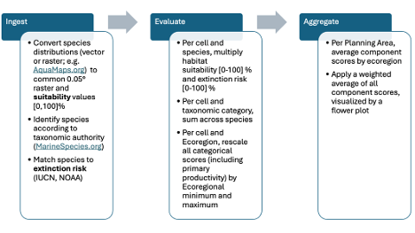{#fig-methods}

## Visualization and Decision Support

The MST utilizes interactive visualizations, including the Flower Plot (see @fig-planarea_flower-plot_scores and the [interactive app](https://app.marinesensitivity.org/mapgl_v1)), to convey complex vulnerability assessment results. The Flower Plot displays component sensitivity scores for each Planning Area, where:

-   Each **petal** represents a taxonomic group (e.g., mammals, birds, fish, invertebrates, corals, turtles) or primary productivity. The **length** of the petal reflects the rescaled sensitivity score (0-100) for that component within the Planning Area.

-   The **center number** is the overall composite sensitivity score, calculated as the equal-weighted average of all component scores.

For example, a Planning Area with a long mammal petal and short fish petal indicates relatively high marine mammal sensitivity but lower fish sensitivity. This decomposition helps decision-makers identify which ecological elements are driving vulnerability in a given location, supporting more informed spatial planning and targeted impact assessment.

# Results

## Species Distributions

+-----------------------------+--------------+-----------------------------------------------------------------------+-----------------------+-----------------------+--------------------+
| **Dataset**                 | **Response** | **Geography**                                                         | **Taxonomy**          | **\# Species in USA** | **Resolution**     |
+-----------------------------+--------------+-----------------------------------------------------------------------+-----------------------+-----------------------+--------------------+
| AquaMaps                    | Suitability\ | Global                                                                | All marine taxa\      | 17,550                | 0.5° → 0.05°\      |
|                             | \[0-100%\]   |                                                                       | (except birds)        |                       | (bilinear)         |
+-----------------------------+--------------+-----------------------------------------------------------------------+-----------------------+-----------------------+--------------------+
| BirdLife Birds of the World | Range\       | Global                                                                | Seabirds              | 573                   | Vector → 0.05°\    |
|                             | \[50%\]      |                                                                       |                       |                       | (50%)              |
+-----------------------------+--------------+-----------------------------------------------------------------------+-----------------------+-----------------------+--------------------+
| NMFS Critical Habitat       | Range\       | USA                                                                   | Listed marine species | 34                    | Vector → 0.05°\    |
|                             | \[70-90%\]   |                                                                       |                       |                       | (70-90%)           |
+-----------------------------+--------------+-----------------------------------------------------------------------+-----------------------+-----------------------+--------------------+
| FWS Critical Habitat        | Range\       | USA                                                                   | Marine/coastal\       | 29                    | Vector → 0.05°\    |
|                             | \[70-90%\]   |                                                                       | (18 birds, 3 fish,\   |                       | (70-90%)           |
|                             |              |                                                                       | 3 mammals, 5 turtles) |                       |                    |
+-----------------------------+--------------+-----------------------------------------------------------------------+-----------------------+-----------------------+--------------------+
| FWS Current Range Maps      | Range\       | USA                                                                   | Marine/coastal\       | 106                   | Vector → 0.05°\    |
|                             | \[50-90%\]   |                                                                       | (82 birds, 9 fish,\   |                       | (status-dependent) |
|                             |              |                                                                       | 4 mammals,\           |                       |                    |
|                             |              |                                                                       | 7 turtles,\           |                       |                    |
|                             |              |                                                                       | 4 invertebrates)      |                       |                    |
+-----------------------------+--------------+-----------------------------------------------------------------------+-----------------------+-----------------------+--------------------+
| **Total (unique species)**  | **Mixed**    | **USA** \| **All marine taxa** \| **17,333** \| **0.05° standard** \| |                       |                       |                    |
+-----------------------------+--------------+-----------------------------------------------------------------------+-----------------------+-----------------------+--------------------+

: Species distribution datasets contributing to the Marine Sensitivity Toolkit. Response values indicate presence probability or suitability. Resolution shows native format and standardization method. Critical Habitat presence values vary by ESA status (Threatened: 70%, Endangered: 90%). Range map presence values reflect data certainty (legally-designated habitat: 70-90%, expert range maps: 50%). AquaMaps suitability values represent environmental envelope models. All datasets standardized to common 0.05° grid for analysis. {#tbl-datasets}

## Primary Productivity

::: {#fig-map_cell_npp_l48}
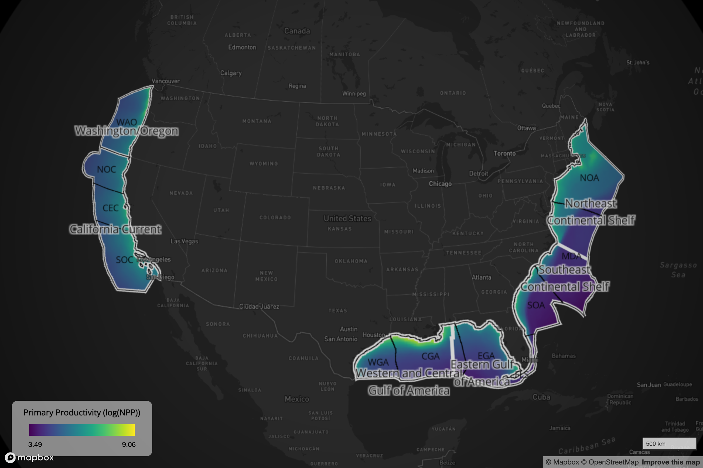

Map of Contiguous US Primary Productivity by pixel.
:::

::: {#fig-map_cell_npp_ak}
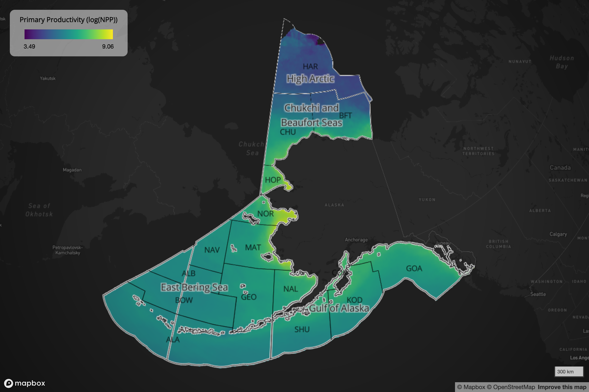

Map of Alaska Primary Productivity by pixel.
:::

::: {#fig-planarea_primprod}
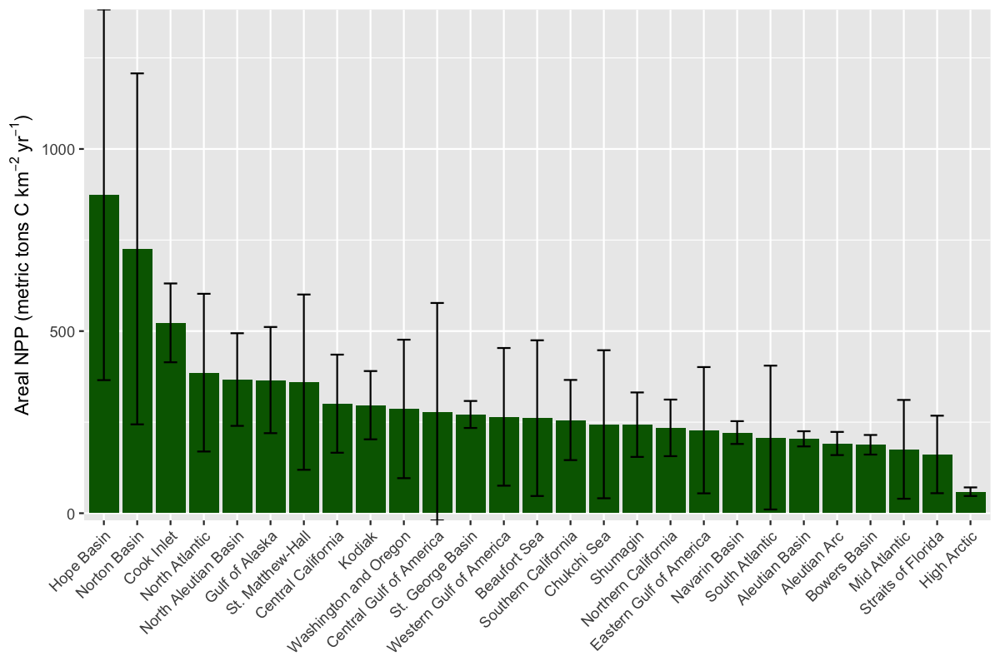

Plot of net primary production (NPP) per Planning Area. Values represent the mean and the standard deviation of 10 annual values for the 2014–2023 period, standardized per unit area.
:::

## Maps of Environmental Sensitivity by Pixel

::: {#fig-map_cell_score_l48}
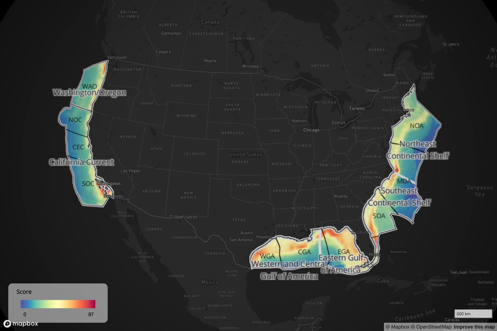

Map of Contiguous US scores by pixel.
:::

::: {#fig-map_cell_score_ak}
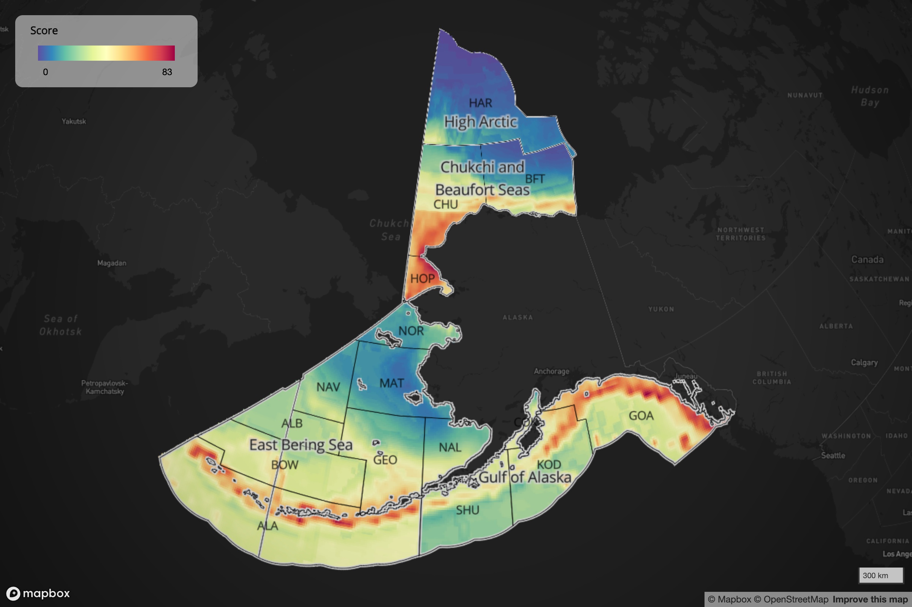

Map of Alaska scores by pixel.
:::

## Maps of Environmental Sensitivity by Planning Area

::: {#fig-map_pa_l48}
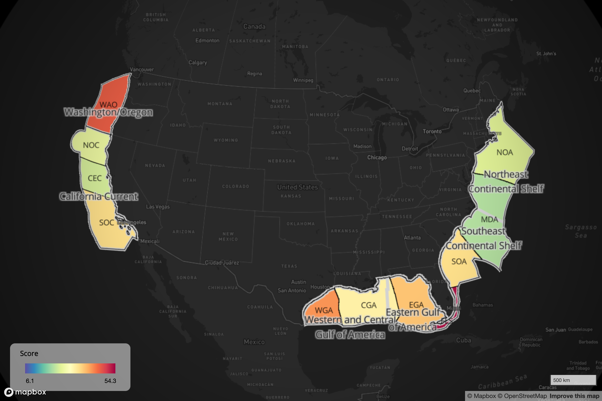

Map of Contiguous US scores by Planning Area.
:::

::: {#fig-map_pa_ak}
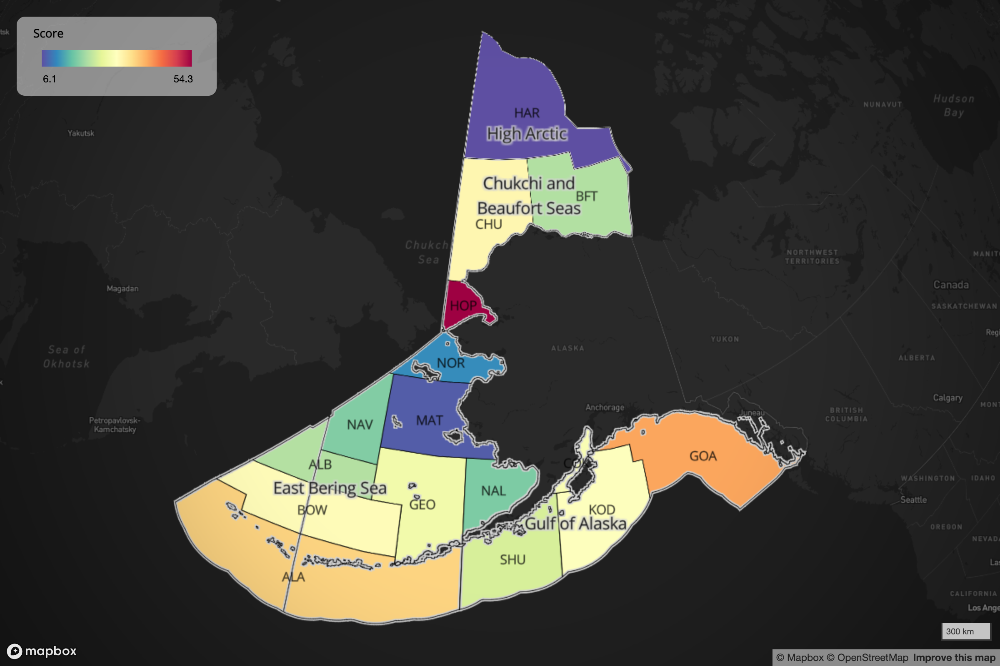

Map of Alaska scores by Planning Area.
:::

## Flower Plot Scores of Environmental Sensitivity by Planning Area

::: {#fig-planarea_flower-plot_scores}
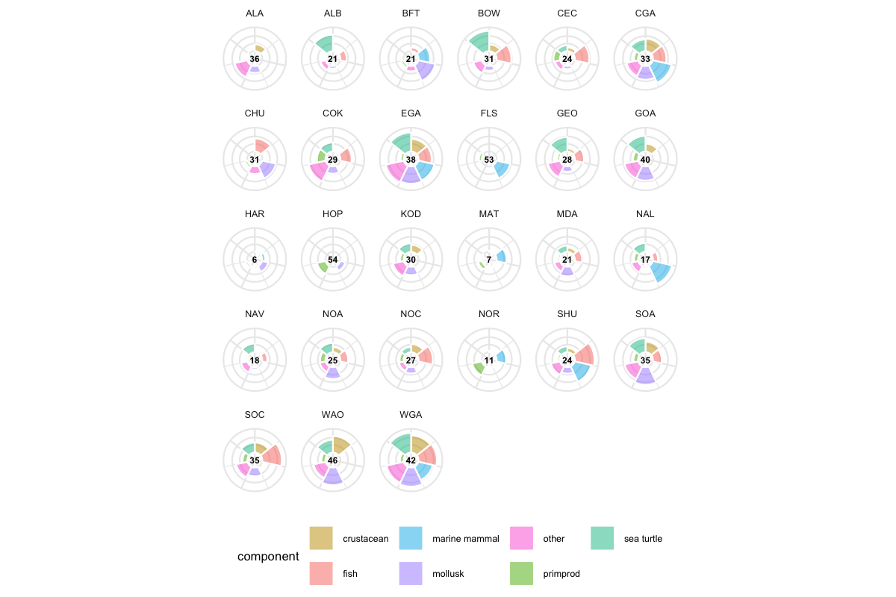

Component and aggregate scores of Marine Environmental Sensitivity in each BOEM Planning Area summarized across taxonomic groups and Primary Productivity. The "petals" of the flower plot represent the component scores and the overall score is given by average number in the middle.
:::

## Online Mapping Application

The MST includes an interactive web application that allows users to explore the sensitivity scores across different planning areas and taxonomic groups. This tool provides a user-friendly interface for visualizing the data and understanding the spatial distribution of marine sensitivity.

::: {#fig-app_mapgl-map}
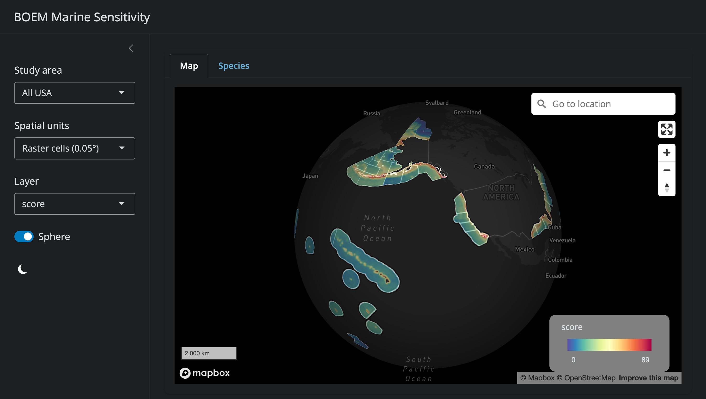

Screenshot of the main app: [mapgl](https://app.marinesensitivity.org/mapgl_v1) showing the raster score for all USA waters.
:::

::: {#fig-app_mapgl-map-pa-socal-flower}
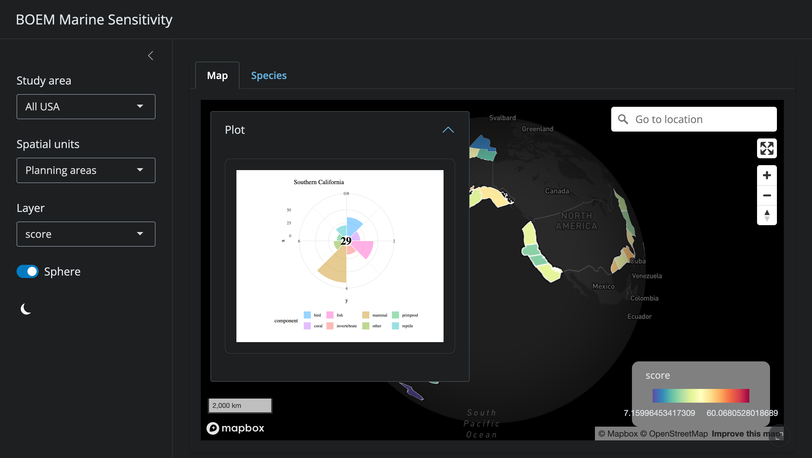

Screenshot of the main app: [mapgl](https://app.marinesensitivity.org/mapgl_v1) showing the Planning Area with flower plot containing component scores as petals and overall score in the middle.
:::

::: {#fig-app_mapgl-species}
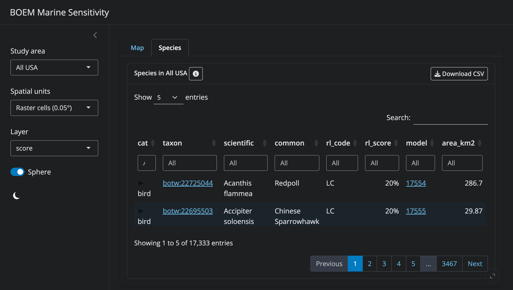

Screenshot of the main app: [mapgl](https://app.marinesensitivity.org/mapgl_v1) showing the Species table. Clicking on the information icon explains the columns and how to interpret the values.
:::

::: {#fig-app_mapsp-blue-whale}
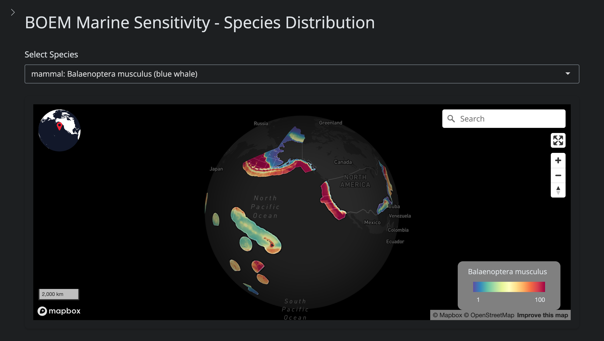

Screenshot of the species distribution app: [mapsp](https://app.marinesensitivity.org/mapsp_v1) showing the species distribution, in this case for the blue whale which is globally distributed.
:::

The main app [mapgl](https://app.marinesensitivity.org/mapgl_v1) app (@fig-app_mapgl-map; @fig-app_mapgl-map-pa-socal-flower; @fig-app_mapgl-species) shows the overall scores and any underlying components by 0.05° raster cell or Planning Area, all masked by the chosen Study area. The model link in the Species table (@fig-app_mapgl-species) links to the species distribution app [mapsp](https://app.marinesensitivity.org/mapsp_v1) (@fig-app_mapsp-blue-whale), which shows the distribution of the species, in this case for the blue whale, which is globally distributed.

## Reproducible Infrastructure

In direct alignment with Executive Order 14303: Restoring Gold Standard Science, the MST is built entirely using open-source tools, and all source code is publicly available through GitHub at [github.com/MarineSensitivity](https://github.com/MarineSensitivity). The entire workflow, from data acquisition to sensitivity scoring, is documented in executable Quarto notebooks and available for independent review and replication. This commitment to transparency ensures that the analysis can be verified, updated, and extended as new data becomes available or methodologies evolve.

The MST comprises 8 core infrastructure components, each maintained as a separate GitHub repository. These tools and analyses are works in progress and will be continually updated as new data and methods become available.

### Server

[**Server**](https://github.com/MarineSensitivity/server)\
All server software is setup using containerized open-source software with Docker to readily spin up the necessary services (particularly: Shiny, RStudio, R Plumber, PostGIS, caddy and pg_tileserv, titiler).

### Database

A spatially enabled Postgres database serves the vector data, while being supplemented by the performance and portability of DuckDB for generating on-the-fly rasters of biodiversity metrics.

### Workflows

[Workflows](https://marinesensitivity.org/workflows/)\
The scientific workflows comprise of notebooks that perform exploration, creation and ingestion processes while rendering markdown and chunks of scientific languages (R or Python) into rendered html for inspection and archive.

### APIs

[APIs](https://github.com/MarineSensitivity/api)\
The application programming interfaces (API) enable standardized retrieval of data products from the server with simple parameters for visualization and analytics, such as the vector tile API at [tile.marinesensitivity.org](https://tile.marinesensitivity.org/) (via pg_tileserv), raster tile API at [titiler.marinesensitivity.org](https://titiler.marinesensitivity.org/api.html) (via TiTiler) or the custom API at [api.marinesensitivity.org](https://api.marinesensitivity.org/) (via Plumber).

### Libraries

[Libraries](https://marinesensitivity.org/msens/reference/index.html)\
Packaging functions with documentation enables reusability across analysis and visualization for simplifying existing applications while extending functionality to outside projects. The [msens](https://marinesensitivity.org/msens/reference/index.html) R package provides functions for analyzing biodiversity data on the desktop.

### Apps

[Apps](https://github.com/marinesensitivity/apps)\
The applications have all been built with the R Shiny framework. The core application is at [app.marinesensitivity.org/mapgl_v1](https://app.marinesensitivity.org/mapgl_v1), and links out to the individual species mapper [app.marinesensitivity.org/mapsp_v1](https://app.marinesensitivity.org/mapsp_v1). Additional experimental applications can be found at [marinesensitivity.org/docs/apps.html](https://marinesensitivity.org/docs/apps.html). The apps actively use functions from the libraries, APIs, and direct database calls.

### Docs

[Docs](https://marinesensitivity.org/docs)\
The documentation is principally a book (rendered from Quarto) oriented for scientific and technical audiences, but also applies to documentation throughout the project for reproducibility and usability.

### Website

[**Website**](https://github.com/MarineSensitivity/MarineSensitivity.github.io)\
The website [marinesensitivity.org](https://marinesensitivity.org/) provides the project landing page with the general public as the initial audience, with content and links (such as to the docs) for deeper understanding.

# Conclusions

The Marine Sensitivity Toolkit represents a transformative advancement in BOEM's capability to fulfill its statutory mandate under Section 18(a)(2)(G) of the Outer Continental Shelf Lands Act to consider "the relative environmental sensitivity and marine productivity of different areas of the OCS." By integrating 17,333 species distribution models, comprehensive extinction risk data, and decade-averaged primary productivity across 6.2 million high-resolution grid cells, the MST delivers unprecedented spatial detail and taxonomic coverage for environmental decision-making. This Phase 1 deliverable establishes the foundational framework and analytical infrastructure; the MST will be continually refined and updated as new data sources, improved species distribution models, and enhanced methodologies become available.

## Alignment with FAIR Data Principles

The MST fully embodies FAIR (Findable, Accessible, Interoperable, Reusable) data principles, ensuring long-term utility and scientific integrity:

**Findable**: All data products, code repositories, and documentation are indexed through persistent URLs at marinesensitivity.org with comprehensive metadata. Species distributions are linked to authoritative taxonomic identifiers (WoRMS AphiaID, GBIF taxonID, ITIS TSN, IUCN taxon ID), enabling unambiguous species lookup across databases. DOIs will be assigned to major data releases for permanent scholarly citation.

**Accessible**: Interactive web applications (https://app.marinesensitivity.org/mapgl_v1) provide immediate public access to sensitivity scores and underlying data without requiring specialized software. Programmatic access through RESTful APIs (tile.marinesensitivity.org, api.marinesensitivity.org) enables automated data retrieval for research and operational applications. All source code is publicly available through GitHub under open-source licenses.

**Interoperable**: Data products adhere to Open Geospatial Consortium (OGC) standards including GeoTIFF, GeoJSON, and vector tiles. DuckDB analytical database enables SQL-based querying with spatial extensions. Future deployment of STAC (SpatioTemporal Asset Catalog) catalogs will enable seamless integration with cloud-native geospatial workflows. Species taxonomies are cross-referenced to ensure interoperability with OBIS, GBIF, IUCN, and other biodiversity platforms.

**Reusable**: Complete analytical workflows are documented in executable Quarto notebooks (e.g., [ingest_aquamaps_to_sdm_duckdb.qmd](https://marinesensitivity.org/workflows/ingest_aquamaps_to_sdm_duckdb.html), [ingest_productivity.qmd](https://marinesensitivity.org/workflows/ingest_productivity.html), [calc_scores.qmd](https://marinesensitivity.org/workflows/calc_scores.html)) with explicit provenance from raw data to final products. Modular R packages (`msens`) provide reusable functions for sensitivity analysis beyond BOEM applications. Comprehensive metadata describe data quality, uncertainty, and appropriate use limitations.

## Meeting Executive Order 14303 Requirements

In direct response to Executive Order 14303: Restoring Gold Standard Science (May 29, 2025), the MST exemplifies scientific integrity through:

**Best Available Science**: Integration of the most current, peer-reviewed data sources including AquaMaps 2019, BirdLife BOTW 2024.2, IUCN Red List 2025, VIIRS-VGPM 2023, and ESA critical habitat as of 2025. Regular update cycles ensure incorporation of new species assessments, range shifts, and improved distribution models.

**Transparency**: Every analytical step is documented with source code and intermediate outputs publicly accessible. Sensitivity scoring algorithms are mathematically explicit with clear justification for weighting schemes. Quality control procedures are documented, including handling of data conflicts and uncertainty.

**Reproducibility**: Complete computational environment specified through Docker containers and R package versions. Workflows use directed acyclic graphs (DAGs) to track data dependencies, ensuring any component can be regenerated from source data. Version control through GitHub enables tracking of methodological evolution.

**Peer Review**: Methods build upon established ecological risk assessment frameworks (e.g., IUCN spatial data standards, VGPM productivity model validation literature) with transparent adaptation for BOEM's decision context.

## Rapid Species-at-Risk Assessment

The MST provides unprecedented capability for rapid identification and characterization of species at elevated risk within proposed lease areas:

**Fine-Scale Spatial Resolution**: 0.05° grid cells (2-5.5 km) capture habitat heterogeneity and localized species hotspots often missed by coarser assessments. This resolution enables differentiation of sensitivity within planning areas, supporting site-specific lease stipulations.

**Taxonomic Comprehensiveness**: Coverage of 17,333 species across all major marine taxa (6,682 fishes, 8,525 invertebrates, 505 birds, 819 corals, 99 mammals, 42 turtles) ensures no major taxonomic group is overlooked. Critical Habitat and ESA range maps provide legally-mandated coverage of federally-listed species.

**Extinction Risk Integration**: Direct linkage of species distributions to IUCN Red List and ESA status enables immediate identification of threatened and endangered species within any area of interest. The precautionary principle (using maximum risk category when multiple assessments exist) ensures conservative risk characterization.

**Dynamic Query Capability**: Interactive applications enable real-time exploration of sensitivity drivers. Users can identify which specific species, taxonomic groups, or risk categories contribute most to a location's sensitivity score, facilitating targeted impact assessment and mitigation design.

**Ecoregional Context**: Rescaling within ecoregions provides ecologically meaningful comparisons. A "moderate" sensitivity score in the species-rich Gulf of America represents fundamentally different ecological conditions than the same score in the Arctic, enabling region-appropriate decision-making.

## Foundation for Mitigation and Adaptive Management

Sensitivity scores directly inform multiple stages of offshore energy development planning and mitigation:

**Lease Area Identification**: High-resolution sensitivity maps ([@fig-map_cell_score_l48; @fig-map_cell_score_ak]) provide a full spectrum of sensitivity across U.S. waters, from low to high. Areas with lower sensitivity scores represent locations where offshore energy development may proceed with reduced ecological risk, making them strong candidates for priority leasing consideration. Conversely, areas with higher sensitivity scores indicate biodiversity hotspots and endangered species habitat where enhanced protections may be warranted. Flower plots (@fig-planarea_flower-plot_scores) reveal which taxonomic groups drive sensitivity in each Planning Area, enabling targeted avoidance strategies focused on the most ecologically significant components.

**Temporal Restrictions**: Integration of seasonal species distribution models (future Phase 2 enhancement) will support temporal lease stipulations (e.g., avoiding construction during seabird breeding seasons, marine mammal calving periods, or sea turtle nesting migrations).

**Site-Specific Stipulations**: Cell-level sensitivity scores enable graduated mitigation requirements scaled to local ecological importance. Areas with CR (Critically Endangered) species presence may require enhanced monitoring, operational restrictions, or exclusion zones beyond standard best management practices.

**Cumulative Impact Assessment**: Standardized sensitivity metrics enable quantitative evaluation of cumulative effects across multiple projects. Summing impacted cell scores provides objective basis for determining when cumulative thresholds warrant enhanced mitigation or alternative analysis.

**Adaptive Management Triggers**: Baseline sensitivity characterization establishes quantitative monitoring targets. Post-construction monitoring can assess whether observed impacts remain within predicted sensitivity envelopes, triggering adaptive management when thresholds are exceeded.

**Mitigation Hierarchy Application**: The MST supports systematic application of the mitigation hierarchy (avoid \> minimize \> restore \> offset). High sensitivity areas inform avoidance strategies. Moderate sensitivity areas guide minimization measures. Quantified sensitivity losses inform compensatory mitigation scaling.

**Climate Adaptation**: As species distributions shift with changing ocean conditions, updateable models ensure mitigation strategies remain effective. Comparison of current versus projected future sensitivity enables climate-informed long-term planning.

## Scientific and Policy Implications

The MST methodology is readily transferable to other ocean planning contexts including marine protected area design, essential fish habitat designation, shipping route optimization, and marine spatial planning. The open-source, cloud-native architecture enables adoption by other agencies and nations with minimal technical barriers. As species distribution models improve, extinction risk assessments update, and new data sources emerge, the MST provides a stable framework for incorporating best available science into iterative planning cycles, fully realizing the vision of Executive Order 14303 for transparent, reproducible, science-based environmental decision-making.

# Next Steps

The MST is designed to be a living system that will be continually updated as new data becomes available and methodologies evolve. In Phase 2, planned enhancements include:

-   **Refining species distribution models** by validating AquaMaps distributions against contemporary occurrence data from [OBIS](https://obis.org/) and [GBIF](https://www.gbif.org/), and continuing to constrain ranges using [IUCN spatial range maps](https://www.iucnredlist.org/resources/spatial-data-download).

-   **Enhancing geospatial infrastructure** by exporting biodiversity metrics to cloud-optimized GeoTIFFs (COGs) organized in spatio-temporal asset catalogs (STACs) for faster rendering and broader reuse.

-   **Expanding the interactive applications** to support arbitrary area selection (drawn polygons, uploaded shapefiles, gazetteer identifiers) and taxonomic tree navigation for merged products.

-   **Improving data products and delivery** by documenting functions into the msens R library, implementing a directed acyclic graph (DAG) data pipeline using the [targets](https://books.ropensci.org/targets/) library, and providing outputs in multiple formats (shapefile, GeoPackage, GeoJSON, GeoTIFF, COG).

-   **Automating high-quality figure generation** including vector graphics suitable for publication and interactive story-map explainers.

-   **Transferring data and tools to BOEM servers** to ensure all code and data are entirely maintainable internally.

All code will continue to be stored in publicly accessible GitHub repositories under [github.com/MarineSensitivity](https://github.com/MarineSensitivity), with version tags corresponding to each model iteration.

# Study Products

The following products were delivered as part of this study:

-   **Final Report** (this document): Word and PDF formats conforming to the 2025 ESP Report Template.

-   **ESP Study Footprint**: ESRI FileGDB geodatabase containing the study area boundaries (27 OCS Planning Areas), accompanied by a data dictionary (Excel) and ISO 19115 metadata (XML).

-   **Interactive web applications**:
    -   Composite sensitivity scores: [app.marinesensitivity.org/mapgl_v1](https://app.marinesensitivity.org/mapgl_v1)
    -   Species distribution viewer: [app.marinesensitivity.org/mapsp_v1](https://app.marinesensitivity.org/mapsp_v1)

-   **Open-source code repositories**: [github.com/MarineSensitivity](https://github.com/MarineSensitivity) including server, workflows, APIs, libraries (msens R package), and applications.

-   **Project documentation**: [marinesensitivity.org/docs](https://marinesensitivity.org/docs/)

-   **API endpoints**: Vector tile API ([tile.marinesensitivity.org](https://tile.marinesensitivity.org/)), raster tile API ([titiler.marinesensitivity.org](https://titiler.marinesensitivity.org/api.html)), custom data API ([api.marinesensitivity.org](https://api.marinesensitivity.org/)).

-   **Project website**: [marinesensitivity.org](https://marinesensitivity.org)

# Map of Study Area

The study area encompasses all 27 BOEM OCS Planning Areas (19 in the lower 48 states and territories, 8 in Alaska), spanning Arctic, temperate, and subtropical marine ecosystems across U.S. waters. Maps of the study area showing environmental sensitivity scores by pixel and by Planning Area are presented in @fig-map_cell_score_l48, @fig-map_cell_score_ak, @fig-map_pa_l48, and @fig-map_pa_ak.

# References
